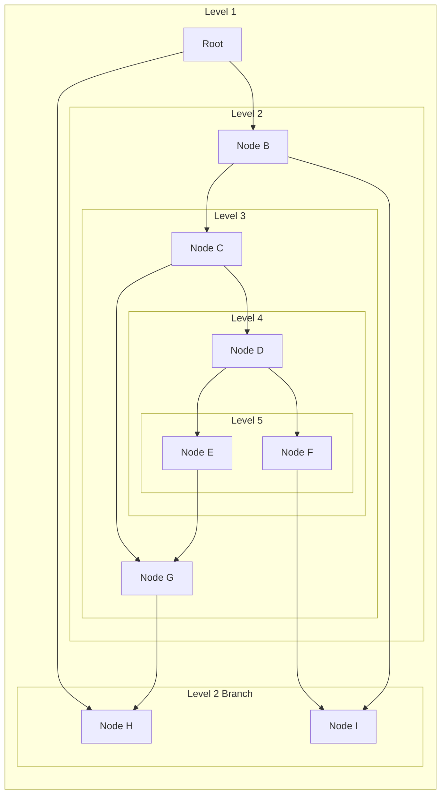
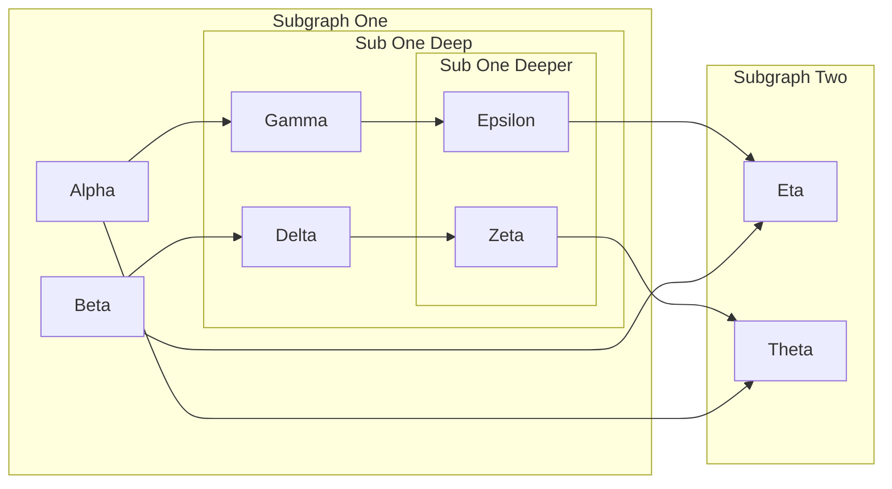
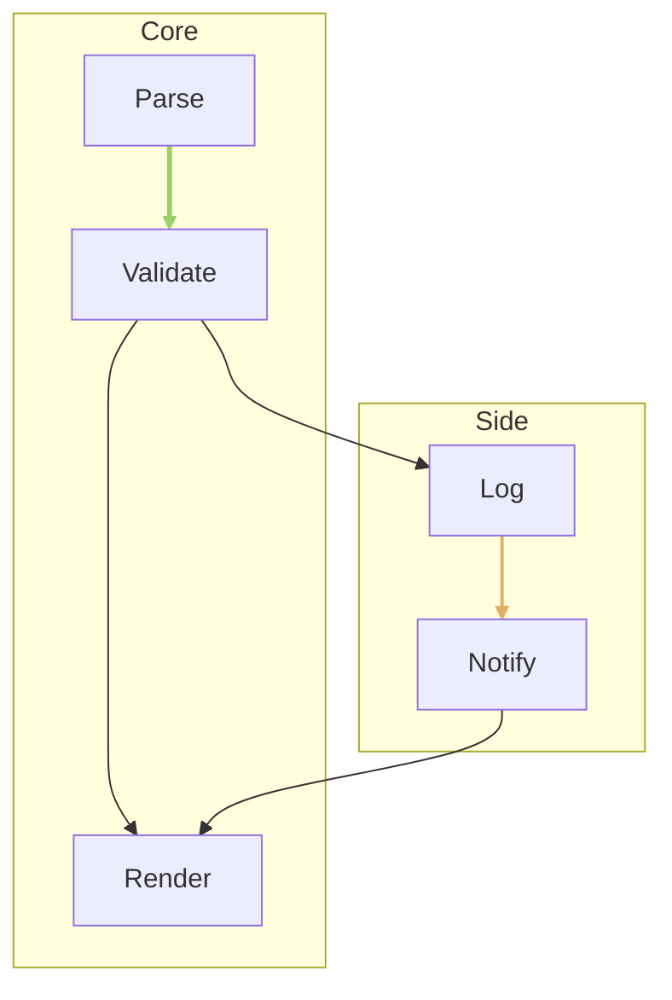

---
navigation:
  title: Mermaid Deep Subgraphs
  position: 8113
---

TEST GOAL: 4-5 levels of nested subgraphs + cross-subgraph hierarchical edges + a different direction at each level

INVARIANTS: nested box containment is correct, cross-level edges neither pierce nor get clipped by boxes, direction takes effect at each level, no compile errors

## Five-Level Nesting with Cross-Layer Edges

Expected: Five nested subgraph levels with alternating internal directions; edges jump multiple subgraph boundaries without being clipped.

## Four-Level Nesting with Subgraph Edges

Expected: Four nested subgraphs; edges declared between nodes of sibling subgraphs route around boxes.

## Nested Subgraph with linkStyle

Expected: linkStyle indices target edges in declaration order even when edges are declared inside subgraphs.

