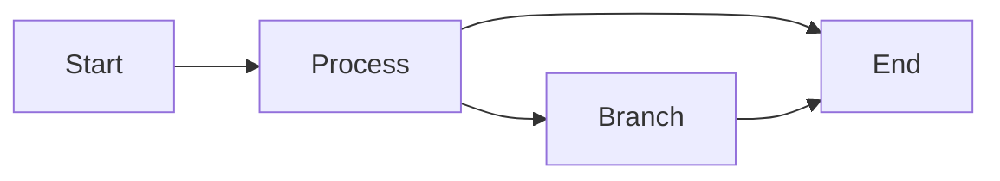
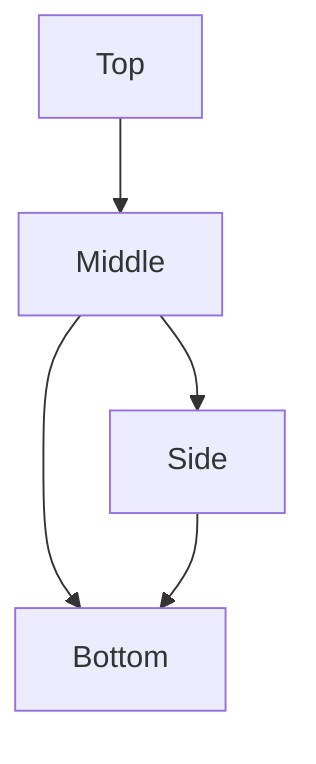
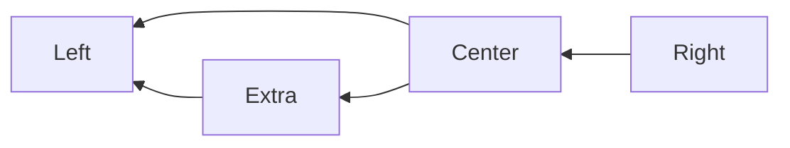
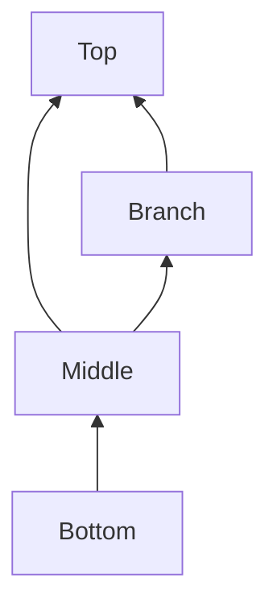
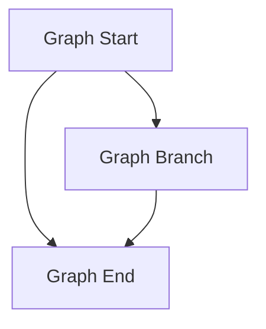
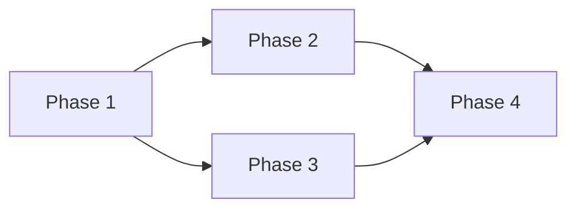

---
navigation:
  title: Mermaid Directions
  position: 8110
---

TEST GOAL: the four flowchart directions (LR / TB / RL / BT) + the `graph` synonym (including the TD abbreviation)

INVARIANTS: each diagram's layout direction is correct, arrow directions follow the diagram direction, no compile errors

## LR (Left to Right)

Expected: Nodes laid out left-to-right; arrows point right.

## TB (Top to Bottom)

Expected: Nodes laid out top-to-bottom; arrows point down.

## RL (Right to Left)

Expected: Nodes laid out right-to-left; arrows point left.

## BT (Bottom to Top)

Expected: Nodes laid out bottom-to-top; arrows point up.

## graph Synonym (TD abbreviation)

Expected: `graph TD` behaves identically to `flowchart TB`; `graph` is accepted as a flowchart declaration keyword.

## graph LR

Expected: `graph LR` renders the same layout as `flowchart LR`.

