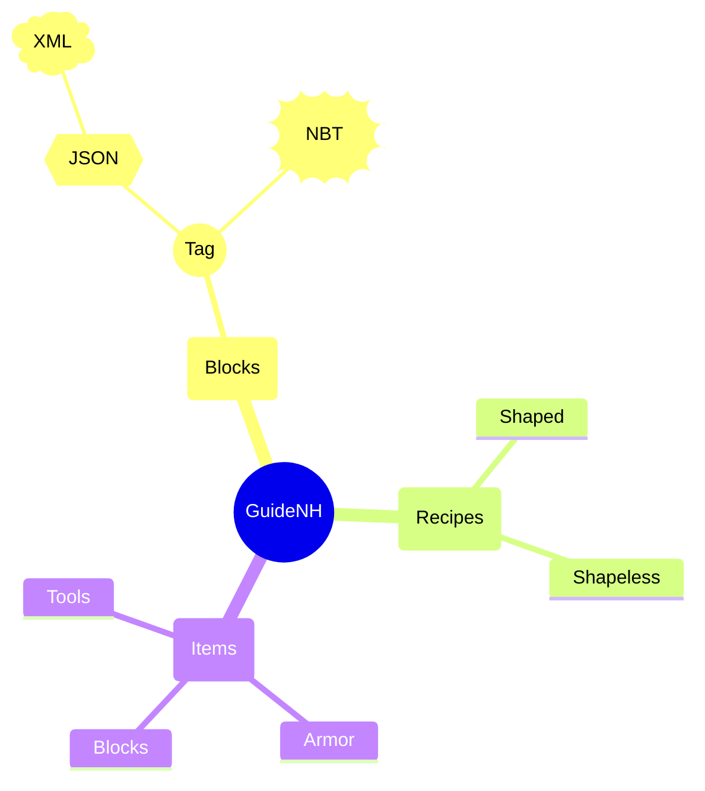
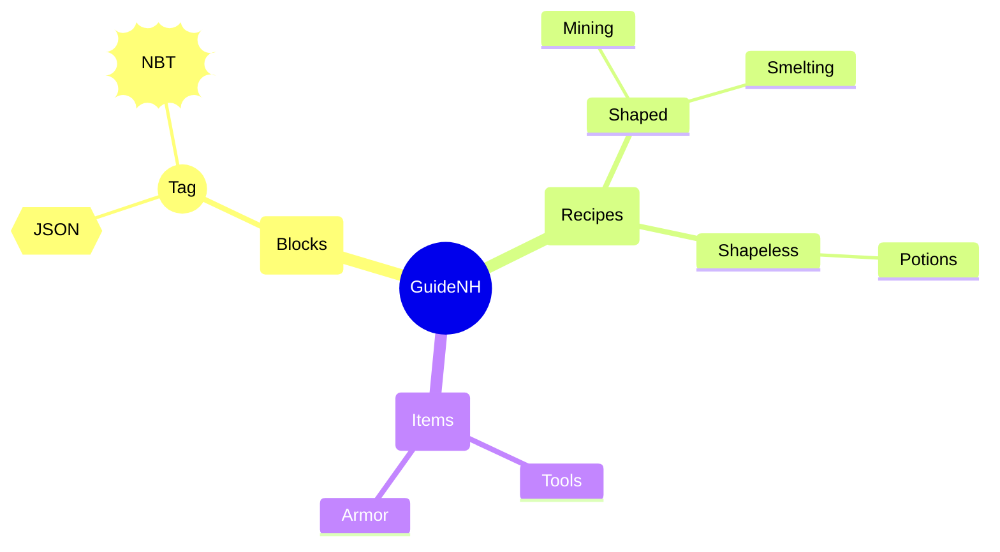
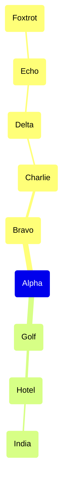

---
navigation:
  title: Mermaid Mindmap Modes
  position: 8190
---

TEST GOAL: the two mindmap layout modes + node shapes + multi-level nesting

INVARIANTS: tree edges are correct, nodes do not overlap, deep nesting does not mix levels

## Default Layout (Alternating Left-Right)

Expected: Root rendered center with children alternating left and right; ≥4 levels of nesting; shapes rendered as rounded (ROUNDED), circle (CIRCLE), hexagon (HEXAGON), cloud (CLOUD), bang (BANG).

## TIDY_TREE Layout Mode

Expected: Tree rendered top-down with children stacked vertically below parent; frontmatter activates tidy-tree mode.

## Deep Nesting (6 Levels)

Expected: In default mindmap mode a deep single-child chain renders as a horizontal spine (each child centered on its parent's row, depth expressed along X) with elbow connection lines and no sibling overlap; vertical top-down hierarchy is the tidy-tree mode (see section above). (Engine enhancement candidate: vertical stagger for deep unary chains to match reference mermaid.)

