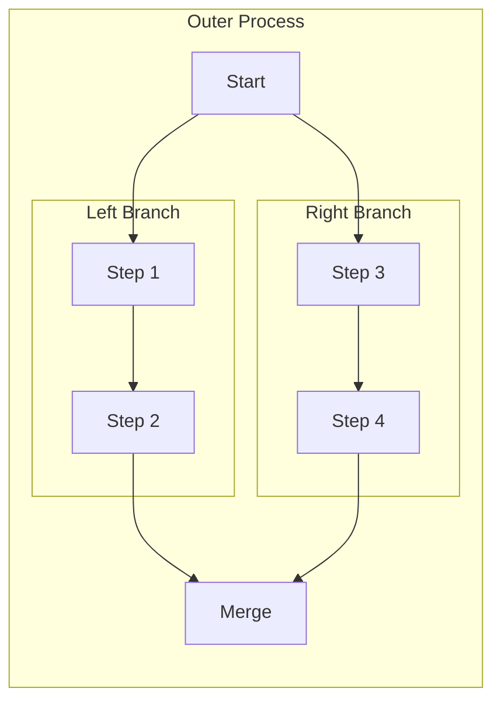
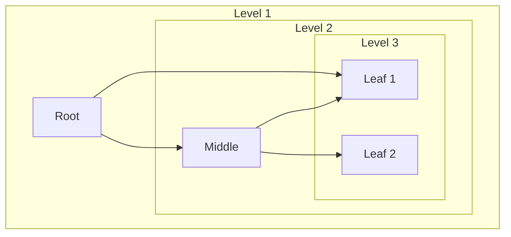
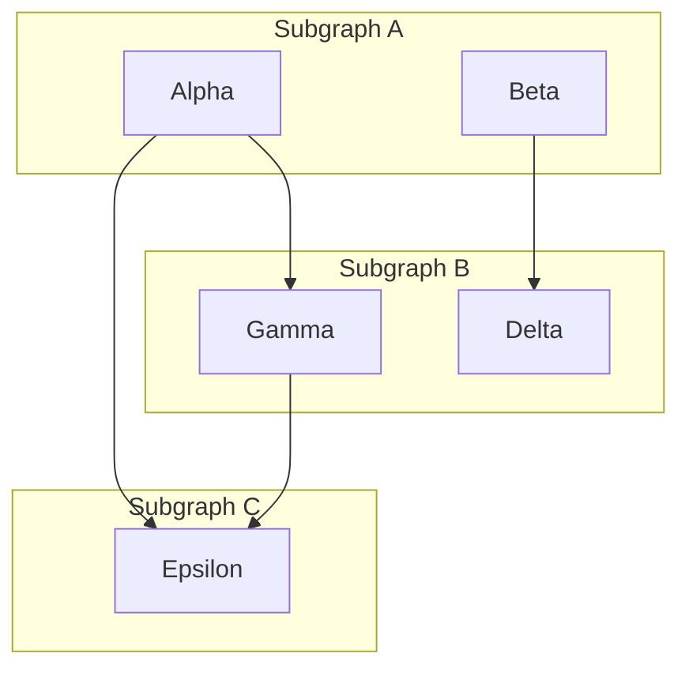

---
navigation:
  title: Mermaid Nested Subgraphs
  position: 8170
---

TEST GOAL: nested subgraphs (2 levels, 3 levels) + edges crossing subgraphs

INVARIANTS: nested box containment is correct, colors are layered, cross edges do not pierce boxes

## Two-Level Nesting

Expected: Outer subgraph contains two inner subgraphs; edges connect nodes across subgraph boundaries; subgraph borders use two different color layers (index 0, 1).

## Three-Level Nesting

Expected: Three layers of subgraph nesting with distinct background colors per depth level (index 0, 1, 2); edges cross subgraph boundaries correctly.

## Cross-Subgraph Edges

Expected: Edges connecting nodes in different subgraphs pass through subgraph box boundaries without being clipped or misrouted.

