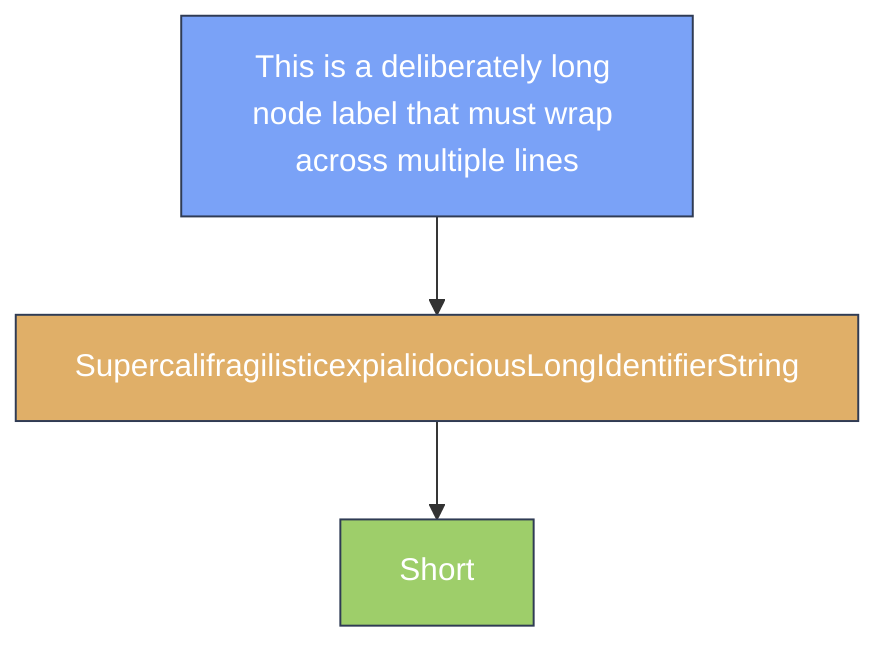

---
navigation:
  title: Mermaid Wrap (forced long-label fold)
  position: 8140
---

TEST GOAL: this page forces mermaid node labels to wrap — long labels trigger word-level wrapping and long space-free words trigger codepoint-level wrapping, verifying that the GuideText.wrap result determines the node box height

INVARIANTS: long-label nodes wrap onto multiple lines correctly, node box height grows with the wrap, no compile errors, no node overflow

## Forced Wrap: Long Label vs Unbroken Long Word vs Short Control

Expected: The long-space-separated label (74 chars, > node single-line budget of 180px) folds across multiple lines via word-level wrapping; the long unbroken word (54 chars, no whitespace) folds via codepoint-level wrapping; the short control label stays on a single line. Node box heights grow with the number of wrapped lines; nothing overflows the diagram bounds.

