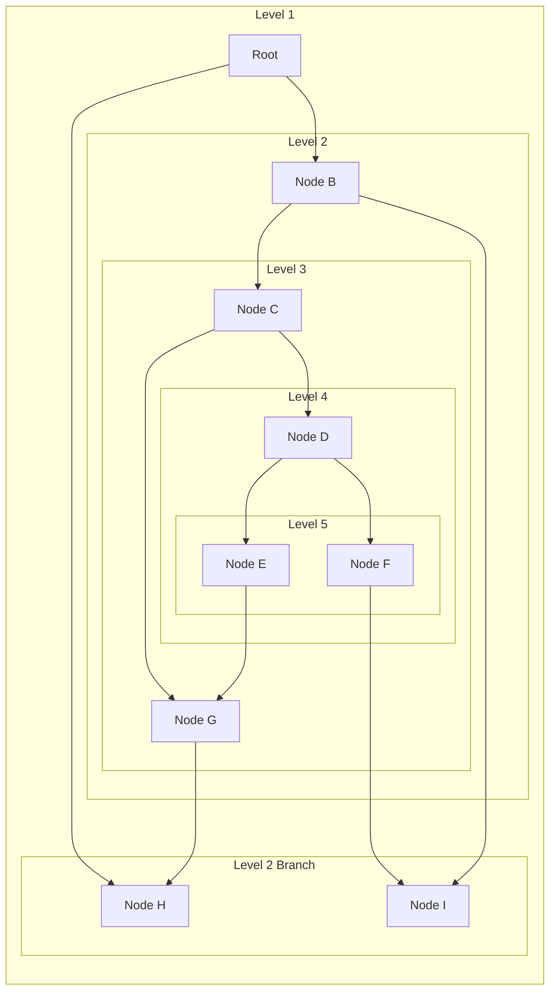
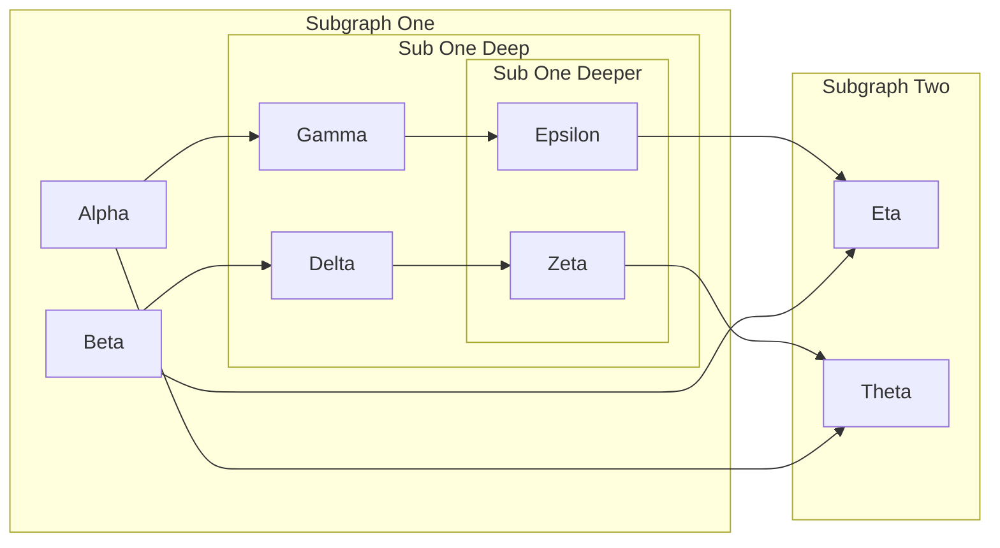
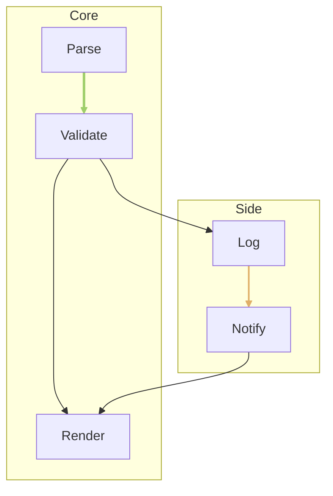

---
navigation:
  title: Mermaid Deep Subgraphs
  position: 8113
---

TEST GOAL / 测试目标：4-5 层嵌套 subgraph + 跨子图层级连线 + 各层不同 direction

INVARIANTS / 不变式：嵌套框包含关系正确、跨层边不穿框不裁切、方向在各层生效、无编译错误

## Five-Level Nesting with Cross-Layer Edges

Expected: Five nested subgraph levels with alternating internal directions; edges jump multiple subgraph boundaries without being clipped.

## Four-Level Nesting with Subgraph Edges

Expected: Four nested subgraphs; edges declared between nodes of sibling subgraphs route around boxes.

## Nested Subgraph with linkStyle

Expected: linkStyle indices target edges in declaration order even when edges are declared inside subgraphs.

