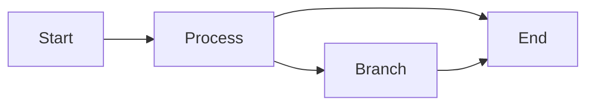
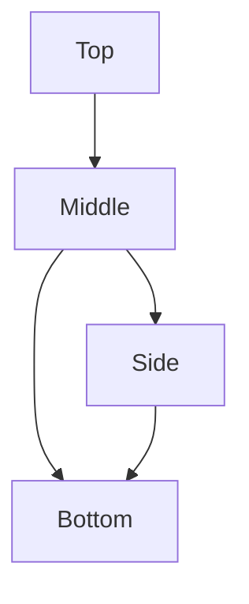
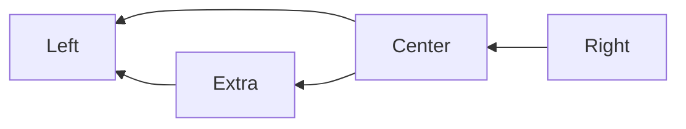
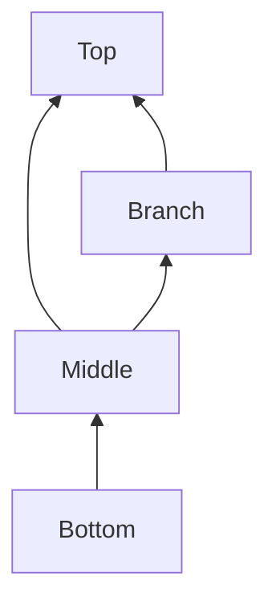
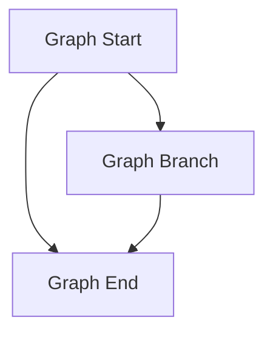
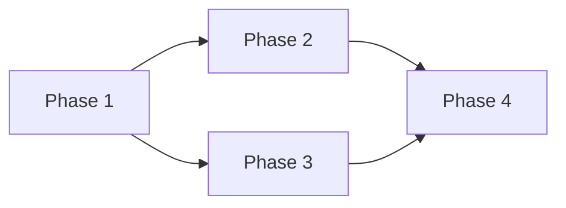

---
navigation:
  title: Mermaid Directions
  position: 8110
---

TEST GOAL / 测试目标：flowchart 四种方向（LR / TB / RL / BT）+ `graph` 同义词（含 TD 缩写）

INVARIANTS / 不变式：各图布局方向正确、箭头指向随方向正确、无编译错误

## LR (Left to Right)

Expected: Nodes laid out left-to-right; arrows point right.

## TB (Top to Bottom)

Expected: Nodes laid out top-to-bottom; arrows point down.

## RL (Right to Left)

Expected: Nodes laid out right-to-left; arrows point left.

## BT (Bottom to Top)

Expected: Nodes laid out bottom-to-top; arrows point up.

## graph Synonym (TD abbreviation)

Expected: `graph TD` behaves identically to `flowchart TB`; `graph` is accepted as a flowchart declaration keyword.

## graph LR

Expected: `graph LR` renders the same layout as `flowchart LR`.

