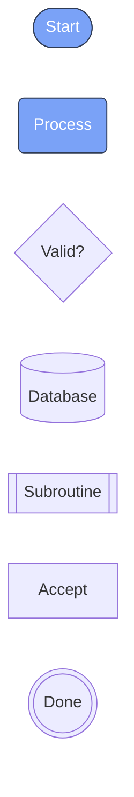
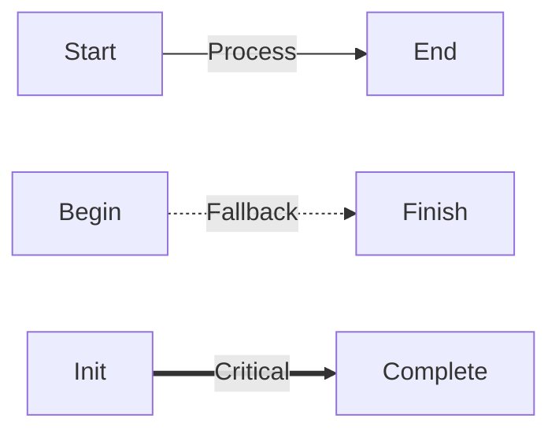
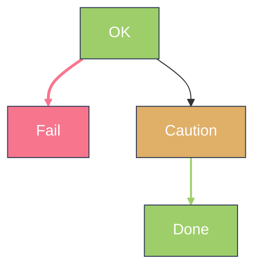

---
navigation:
  title: Mermaid Flowchart Shapes and Edges
  parent: visualtest/index.md
  position: 8180
---

<!--
测试目标：flowchart 节点形状 + 箭头样式 + 边标签 + classDef/linkStyle
不变式：箭头方向正确、标签不压线、形状渲染齐全
-->

## Node Shape Showcase

Expected: Each node displays a distinct shape — stadium, rounded, diamond, rect, cylinder, subprocess, double-circle.



## Arrow Styles (Solid / Dashed / Dotted × Triangle / Circle / Cross)

Expected: Three line styles (solid, dashed, dotted) each combined with three arrow head variants (triangle, circle, cross). Arrows point in correct direction; heads render distinctly.

```mermaid
flowchart LR
  A[Solid]
  B[Dashed]
  C[Dotted]
  D[Circle]
  E[Cross]

  A --> D1[Triangle]
  A --o C1[Circle]
  A --x X1[Cross]

  B -.-> D2[Triangle]
  B -.o C2[Circle]
  B -.x X2[Cross]

  C ~~> D3[Triangle]
  C ~~~ N[NoHead]
```

## Edge Labels

Expected: Labels appear centered on edges without overlapping the line or nodes.



## classDef and linkStyle

Expected: Nodes styled with classDef show custom fill/stroke colors. linkStyle changes edge stroke color and width.


