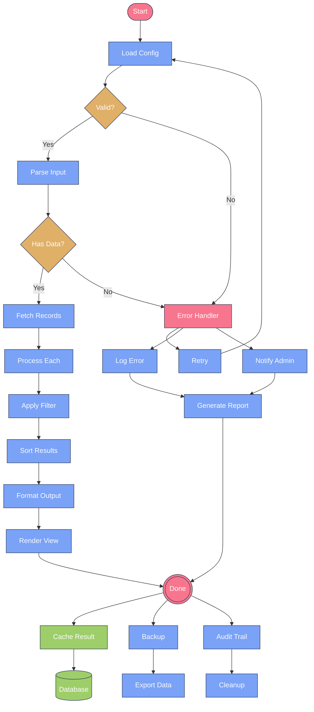
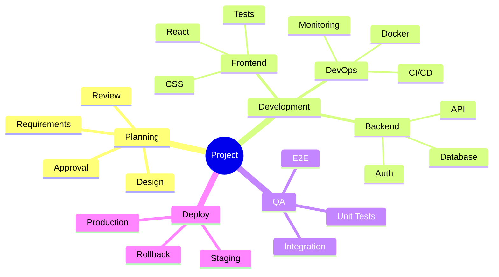

---
navigation:
  title: Mermaid Large Diagram
  position: 8150
---

TEST GOAL / 测试目标：20+ 节点大图，验证容器初始视口与页面高度行为

INVARIANTS / 不变式：初始视口合理、不无限撑高页面

## Large Flowchart (20+ Nodes)

Expected: All 23 nodes rendered in a single diagram; initial viewport shows a reasonable center-cropped portion; page height unaffected by diagram overflow (scroll within the Mermaid container).

## Large Mindmap (20+ Nodes)

Expected: Mindmap with 21 nodes rendered; tree structure visible with root at center and alternating left/right subtrees.

