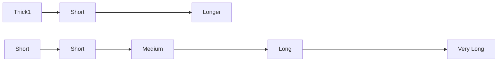
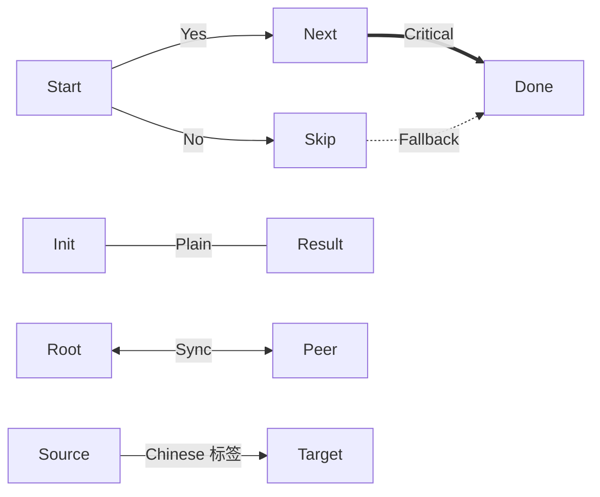
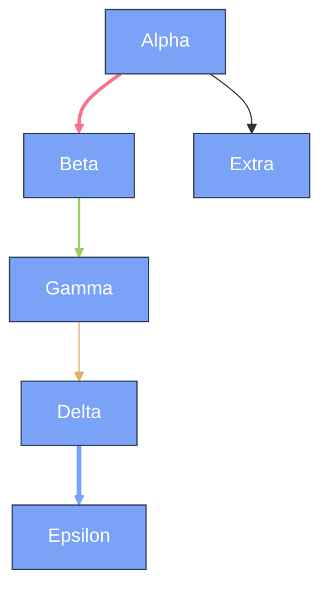

---
navigation:
  title: Mermaid Link Styles
  position: 8112
---

TEST GOAL / 测试目标：箭头样式全集（实线/粗线/虚线/点线 × 三角/圆/叉 头）+ 边标签 + linkStyle

INVARIANTS / 不变式：每种线型与箭头头渲染正确、边标签不压线、linkStyle 颜色线宽生效、无编译错误

## Solid Links — triangle / circle / cross heads

Expected: Solid lines with triangle, circle, and cross arrow heads in both directions.

```mermaid
flowchart LR
  A[Solid] --> B[Arrow]
  C[Line] --- D[Line]
  E[Rev] <--- F[Reverse]
  G[Both] <--> H[Bidirectional]
  I[Circle] --o J[Circle Head]
  K[CircleRev] o-- L[Circle Tail]
  M[CircleBoth] o--o N[Circle Both]
  O[Cross] --x P[Cross Head]
  Q[CrossRev] x-- R[Cross Tail]
  S[CrossBoth] x--x T[Cross Both]
```

## Thick Links

Expected: Thick (=) lines render visibly thicker with matching arrow heads.

```mermaid
flowchart LR
  U[Thick] ==> V[Thick Arrow]
  W[ThickLine] === X[Thick Line]
  Y[ThickBoth] <=> Z[Thick Both]
  AA[ThickRev] <=== AB[Thick Reverse]
  AC[ThickCircle] ==o AD[TC Head]
  AE[ThickCircleRev] o== AF[TC Tail]
  AG[ThickBothLong] <===> AH[Thick Long Both]
```

## Dashed / Dotted Links

Expected: Dashed (dot) and dotted (tilde) lines render with distinct patterns.

```mermaid
flowchart LR
  AI[Dashed] -.-> AJ[Dashed Arrow]
  AK[DashedLine] -.- AL[Dashed Line]
  AM[DashedBoth] <-.-> AN[Dashed Both]
  AO[DashedRev] <-.-- AP[Dashed Reverse]
  AQ[Dotted] ~~> AR[Dotted Arrow]
  AS[DottedLine] ~~~ AT[Dotted Line]
  AU[DottedBoth] <~~> AV[Dotted Both]
  AW[DottedCircle] ~~o AX[DT Circle]
```

## Variable Length Links

Expected: Longer arrows render longer without breaking; arrow heads stay attached.



## Edge Labels

Expected: Labels appear centered on edges without overlapping the line or nodes.



## linkStyle — colors / width / interpolate

Expected: linkStyle changes edge stroke color, width, and interpolation per edge index.


