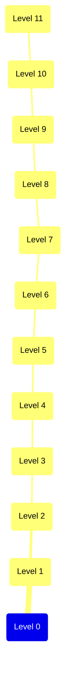
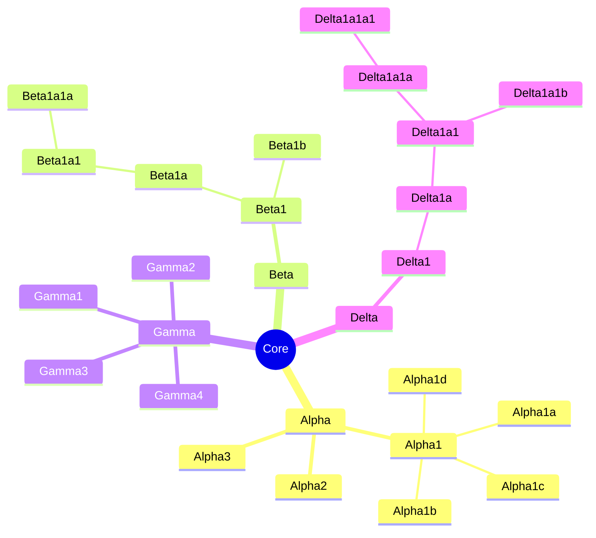
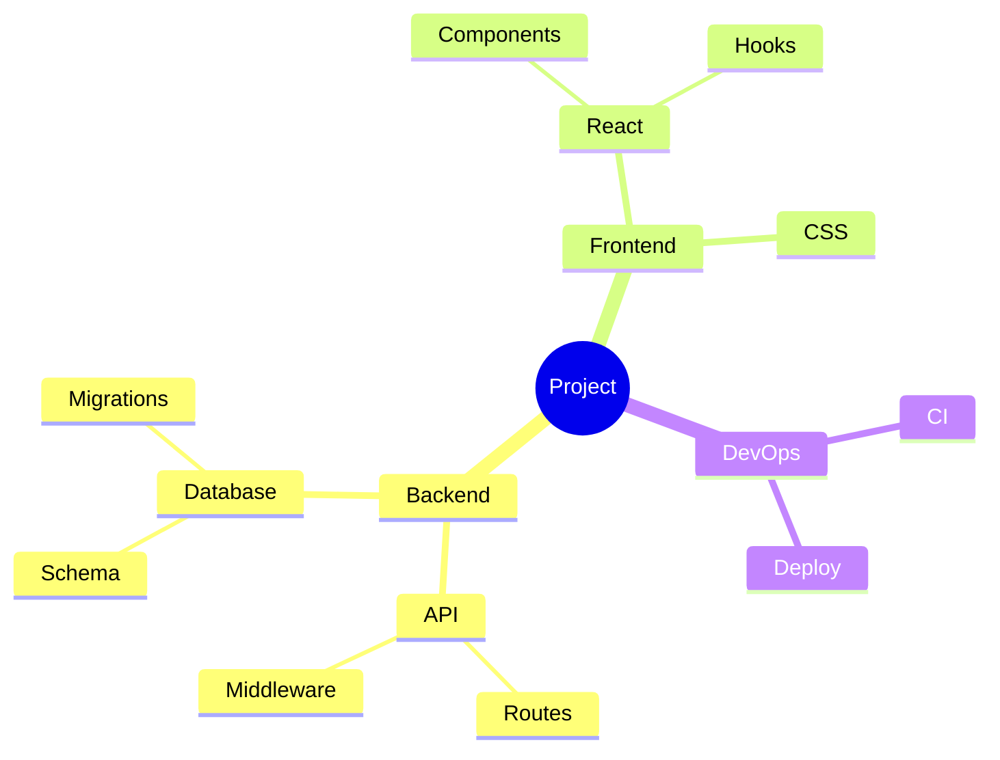

---
navigation:
  title: Mermaid Mindmap Variants
  position: 8115
---

TEST GOAL / 测试目标：mindmap 多分支、深层嵌套（10+ 层）、默认与 tidy-tree 两种模式、形状与 class 变体

INVARIANTS / 不变式：树连线正确、节点不重叠、深层嵌套不串层、两种模式布局区分明显、无编译错误

## Multi-Branch (Default Mode)

Expected: Root with four mixed-depth subtrees; children alternate left/right around the root.

```mermaid
mindmap
  root((Guide))
    Overview
      What
      Why
      How
    Reference
      Mermaid
        Flowchart
        Mindmap
      Markdown
    Guide
      Tables
      Images
    Notes
      Tips
      Warnings
```

## Deep Nesting (12 Levels, Default Mode)

Expected: A single 12-level chain renders without level collision or node overlap.



## Deep + Wide Mixed (Default Mode)

Expected: Alternating deep chains and wide fans; no sibling overlap at any depth.



## Tidy-Tree Mode

Expected: Tree rendered top-down with children stacked below parents; frontmatter `layout: tidy-tree` activates the mode.



## Shape + Class Variants (Tidy-Tree)

Expected: Mindmap shapes (circle, hexagon, cloud, bang, subroutine, cylinder, stadium) plus `:::` class suffix render correctly under tidy-tree layout.

```mermaid
---
config:
  layout: tidy-tree
---
mindmap
  root((GuideNH))
    rounded(Blocks):::primary
      circle((Tags)):::primary
        hexagon{{JSON}}:::code
      cloud)Data(
    subroutine[[Recipes]]:::primary
      cylinder[(Storage)]:::data
      stadium([Output]):::code
    bang))Notes((
```
