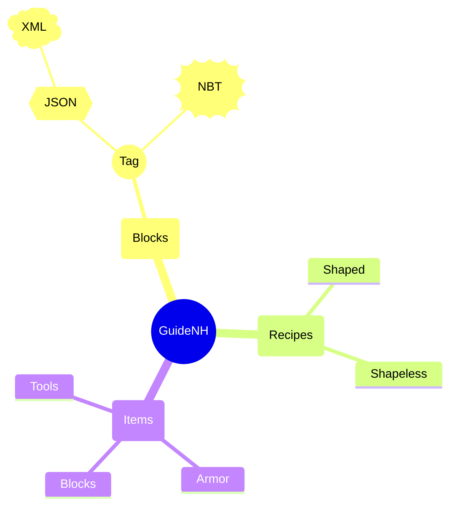
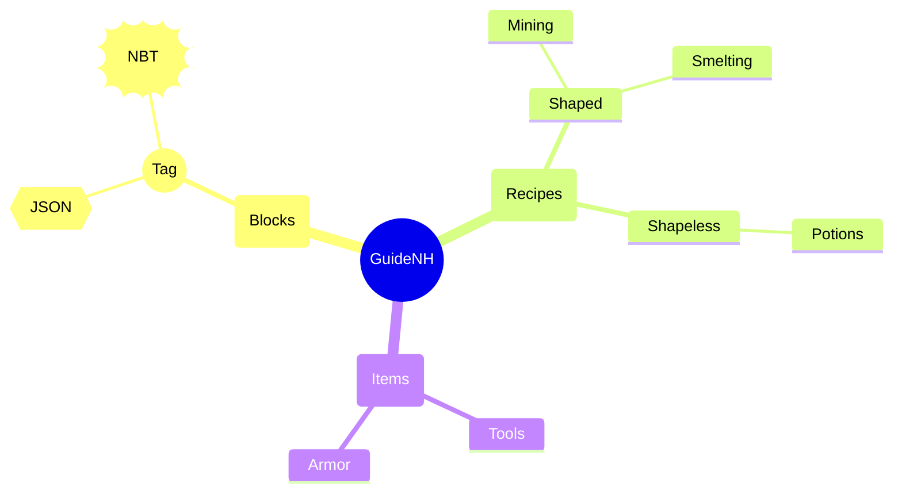
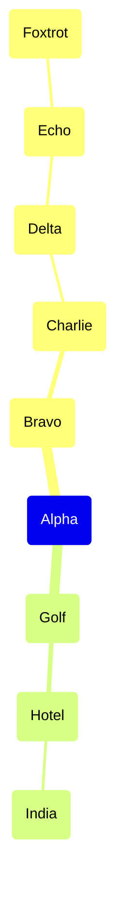

---
navigation:
  title: Mermaid Mindmap Modes
  position: 8190
---

TEST GOAL / 测试目标：mindmap 两种布局模式 + 节点形状 + 多层嵌套

INVARIANTS / 不变式：树连线正确、节点不重叠、深层嵌套不串层

## Default Layout (Alternating Left-Right)

Expected: Root rendered center with children alternating left and right; ≥4 levels of nesting; shapes rendered as rounded (ROUNDED), circle (CIRCLE), hexagon (HEXAGON), cloud (CLOUD), bang (BANG).

## TIDY_TREE Layout Mode

Expected: Tree rendered top-down with children stacked vertically below parent; frontmatter activates tidy-tree mode.

## Deep Nesting (6 Levels)

Expected: Deeply nested nodes maintain correct indentation and connection lines; no visual overlap between sibling branches.

