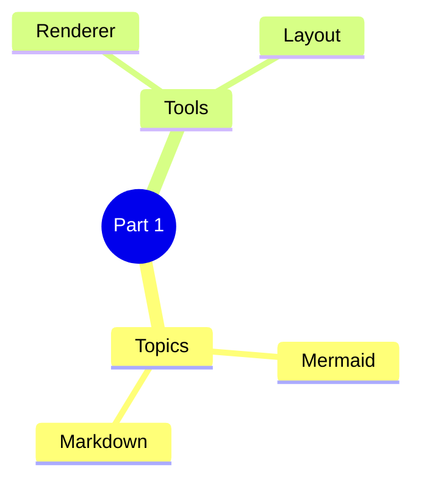
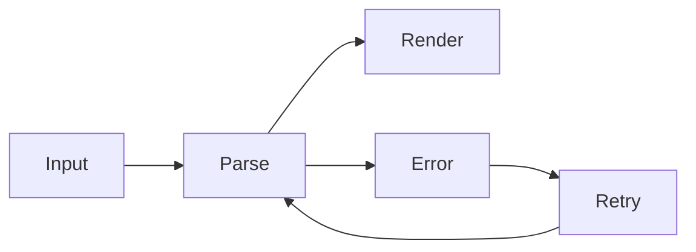
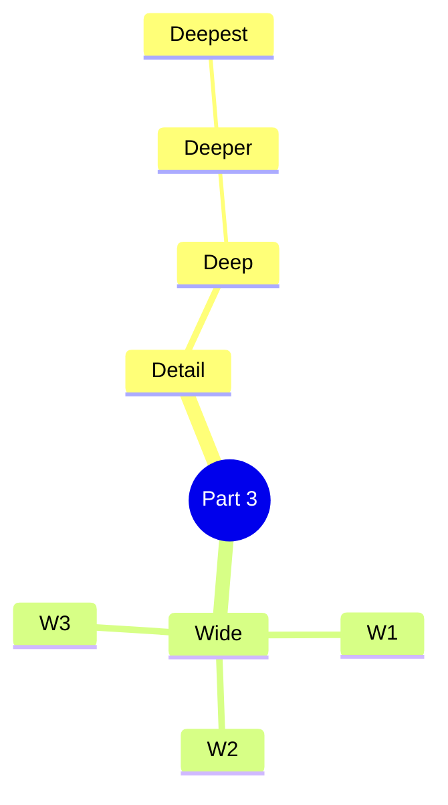
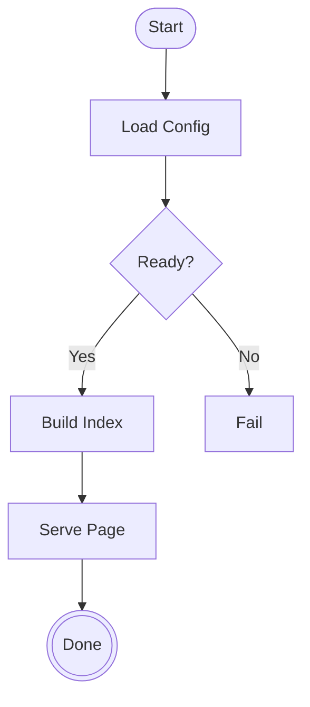
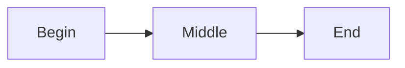

---
navigation:
  title: Mermaid Mixed Multi Segments
  position: 8118
---

TEST GOAL / 测试目标：单页多段混合——mindmap 与 flowchart 交替出现、多段连环、fenced 与 `<Mermaid>` 标签混用

INVARIANTS / 不变式：每段独立编译渲染、类型互不干扰、全部非 stub、无编译错误

## Segment 1: Mindmap (Overview)

Expected: First mindmap renders on its own.



## Segment 2: Flowchart (Pipeline)

Expected: First flowchart renders on its own.



## Segment 3: Mindmap (Detail)

Expected: Second mindmap renders after the flowchart without interference.



## Segment 4: Flowchart (Loop Chain)

Expected: A longer chain mixed with a branch; consecutive mermaid blocks do not bleed into each other.



## Segment 5: Mermaid Tag (Mindmap)

Expected: An `<Mermaid>` tag mindmap renders as its own block in the same page.

<Mermaid width="400" height="300">
mindmap
  root["Tag Segment"]
    Tag Node A
    Tag Node B
      Tag Leaf B1
</Mermaid>

## Segment 6: Mermaid Tag (Flowchart)

Expected: An `<Mermaid>` tag flowchart renders as its own block in the same page.

<Mermaid width="500" height="320">
flowchart LR
  subgraph TagSub["Tag Subgraph"]
    A[Start]
    B[End]
  end
  A --> B
</Mermaid>

## Segment 7: Final Combined

Expected: A final alternating pair closes the page.

```mermaid
mindmap
  root((Final))
    Mindmap Node
    Another
```


