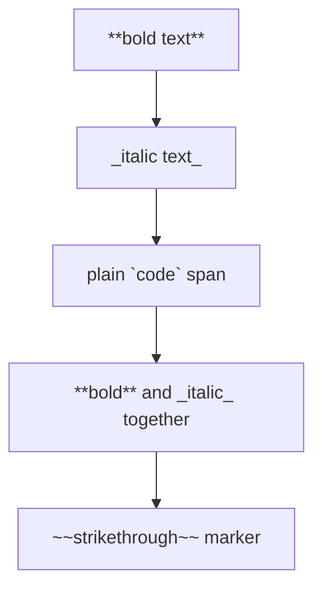
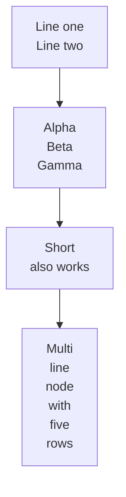
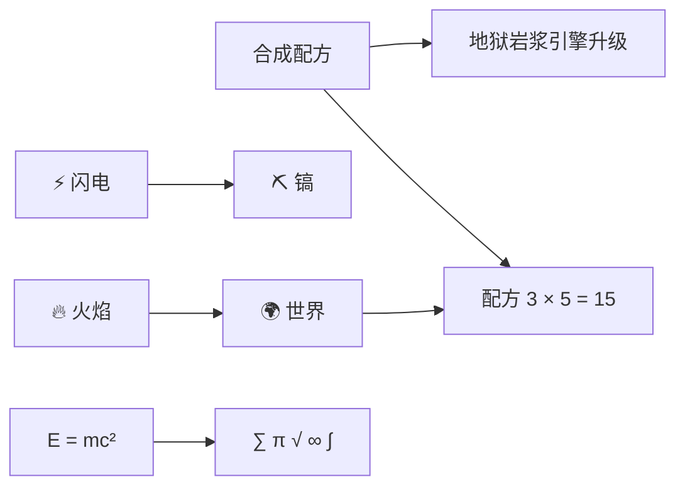
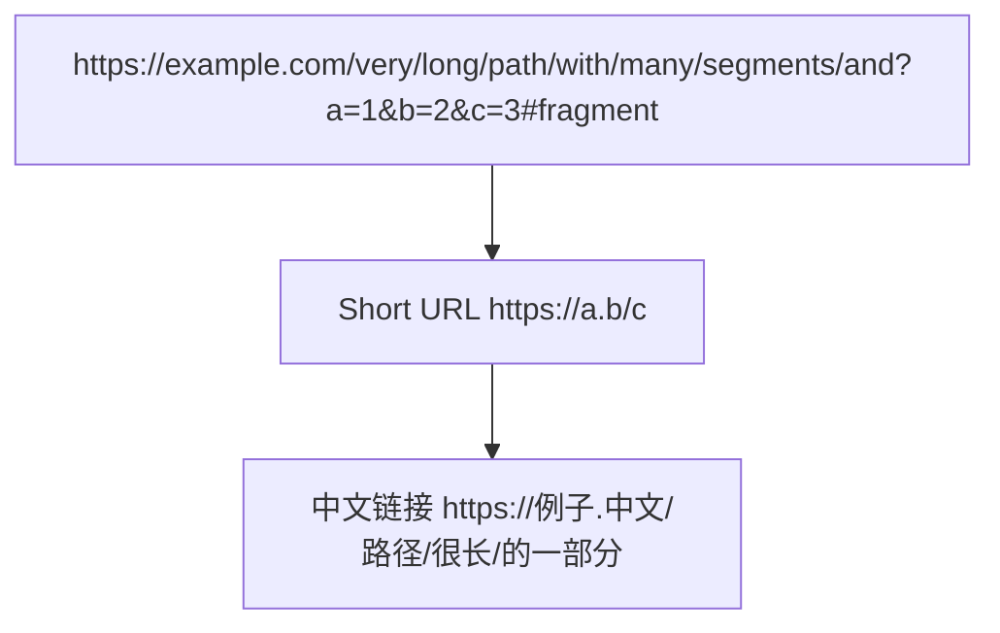

---
navigation:
  title: Mermaid Rich Text Labels
  position: 8116
---

TEST GOAL / 测试目标：节点内富文本标记（**加粗**、_斜体_、`代码`）、行内 `<br>`、特殊字符（中文 / emoji / 数学符号 / 长 URL）

INVARIANTS / 不变式：富文本标记以字面文本渲染不崩溃、`<br>` 正确换行、特殊字符不丢不重叠、无编译错误

## Markup Literals in Labels

Expected: `**bold**` / `_italic_` / `` `code` `` markers render as literal text inside node labels (markdown markup is not processed); no crash, no truncated text.



## Inline <br> Line Breaks

Expected: `<br>` / `<br/>` inside a label produce a line break; node box height grows accordingly.



## Special Characters: Chinese / emoji / math

Expected: CJK, emoji, and math symbols render without missing glyphs or overlapping boxes.



## Long URL in Label

Expected: A long unbroken URL folds via codepoint-level wrapping; node stays inside the diagram bounds.



## Mindmap Rich Labels

Expected: Mindmap nodes carry the same rich/special text without breaking the tree structure.

```mermaid
mindmap
  root((GuideNH))
    **Bold** Branch
      _Italic_ Leaf
      `Code` Leaf
    Emoji Branch
      ⚡ Fast
      🔥 Hot
    Math Branch
      E = mc²
      π ≈ 3.14159
    Chinese
      合成配方
      矿物词典
    Line Break
      First<br>Second
