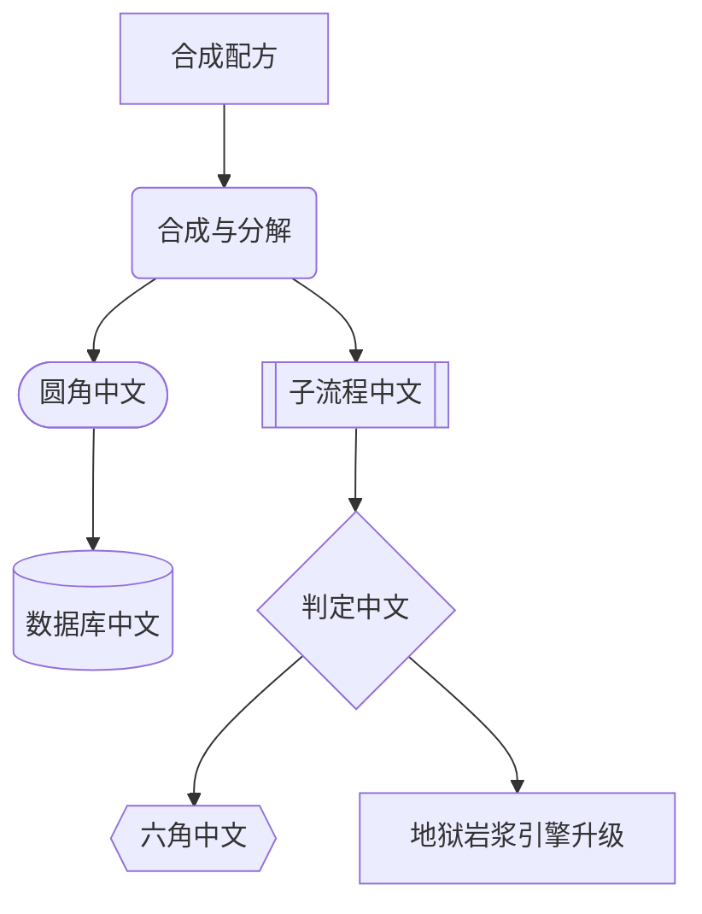
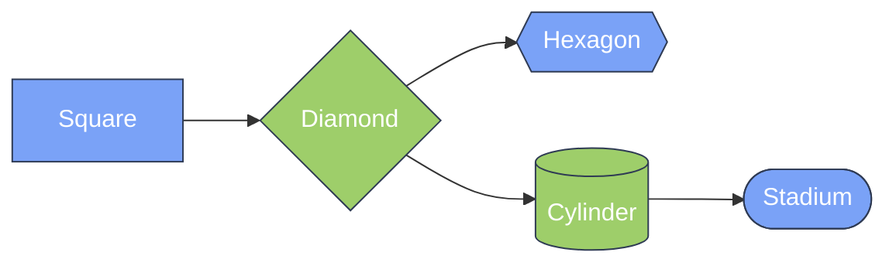

---
navigation:
  title: Mermaid Node Shapes
  position: 8111
---

TEST GOAL / 测试目标：全部节点形状语法变体 + 中文标签节点

INVARIANTS / 不变式：每种形状渲染出对应轮廓、中文标签不丢字不重叠、无编译错误

## All Shape Variants

Expected: Each node renders its documented shape distinct from the others.

```mermaid
flowchart TB
  A[Square]
  B(Round)
  C([Stadium])
  D[[Subroutine]]
  E[(Cylinder)]
  F{Diamond}
  G{{Hexagon}}
  H(-Ellipse-)
  I(((Double Circle)))
  J[/Trapezoid\]
  K[\InvTrapezoid/]
  L[/LeanRight/]
  M[\LeanLeft\]
  N>Asymmetric]
  O))Bang((
  P)Cloud(
```

## Chinese Labels (with shape mix)

Expected: Chinese labels render without missing characters; node boxes size to fit CJK text.



## Shape + classDef combo

Expected: Shape geometries combine with classDef colors; hexagon/diamond/trapezoid keep their outline under fill styling.


