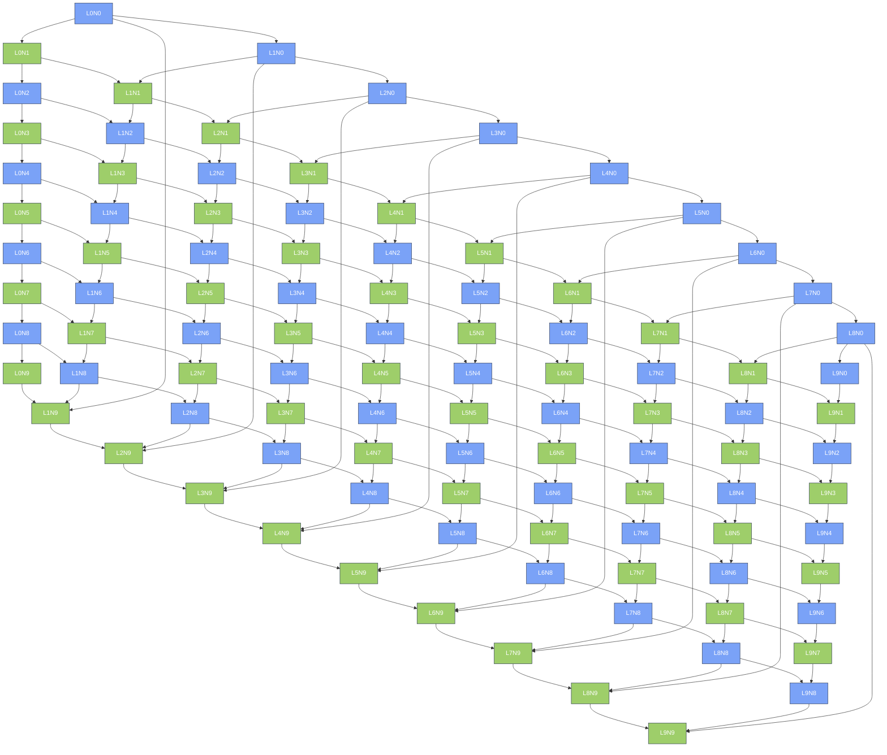
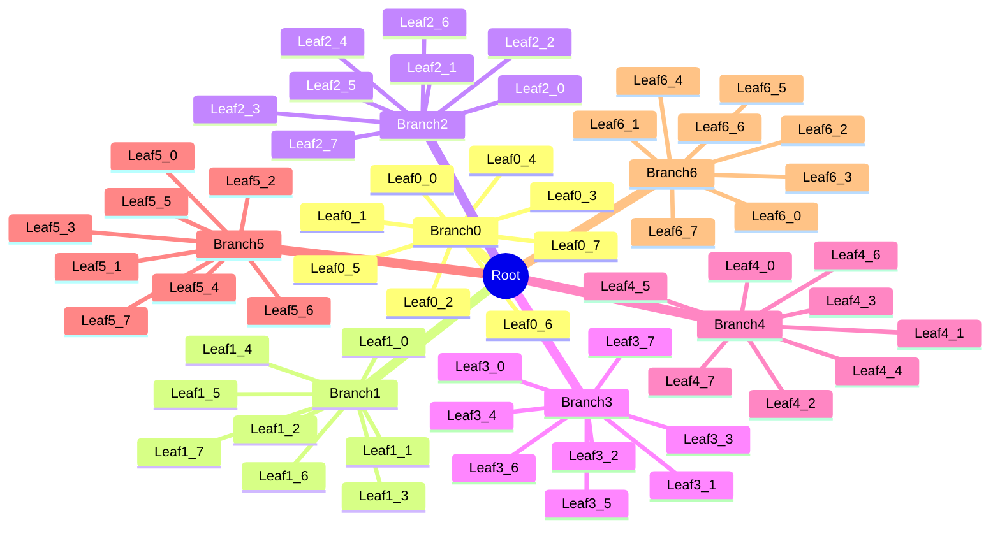

---
navigation:
  title: Mermaid Stress Large
  position: 8114
---

TEST GOAL / 测试目标：100+ 节点 flowchart TB（多层多分支）+ 50+ 节点 mindmap，压力/性能暴露

INVARIANTS / 不变式：大图布局完成不崩溃、无编译错误、非 stub

## Large Flowchart (100 Nodes, 10x10 mesh)

Expected: 100 nodes laid out in a 10-layer grid with vertical, horizontal, and diagonal edges; layout completes without crash or unbounded canvas.

## Large Mindmap (64 Nodes)

Expected: 64-node mindmap with a wide root fanout and deep single-branch chains; alternating left/right subtrees do not overlap.

