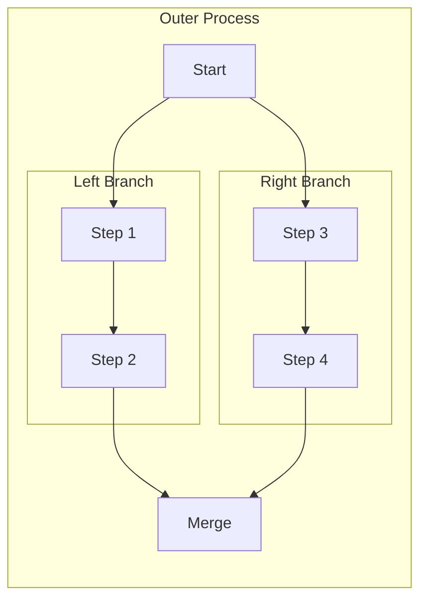
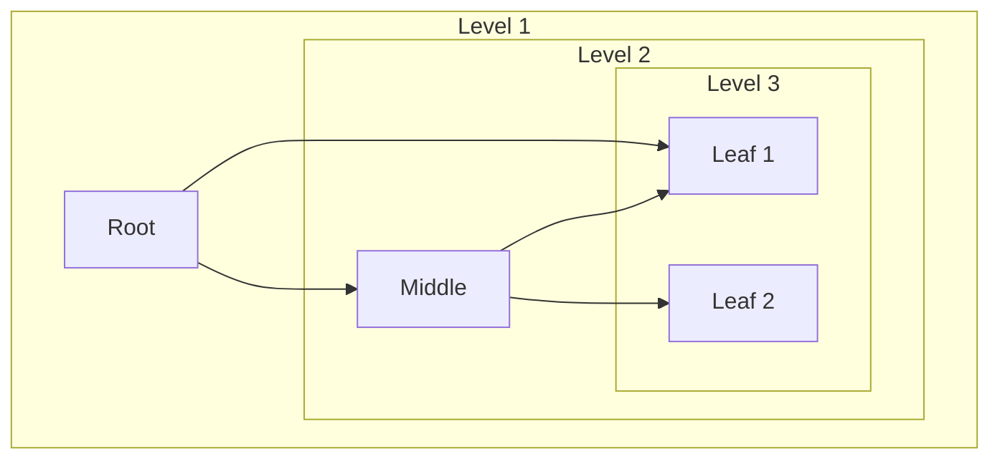
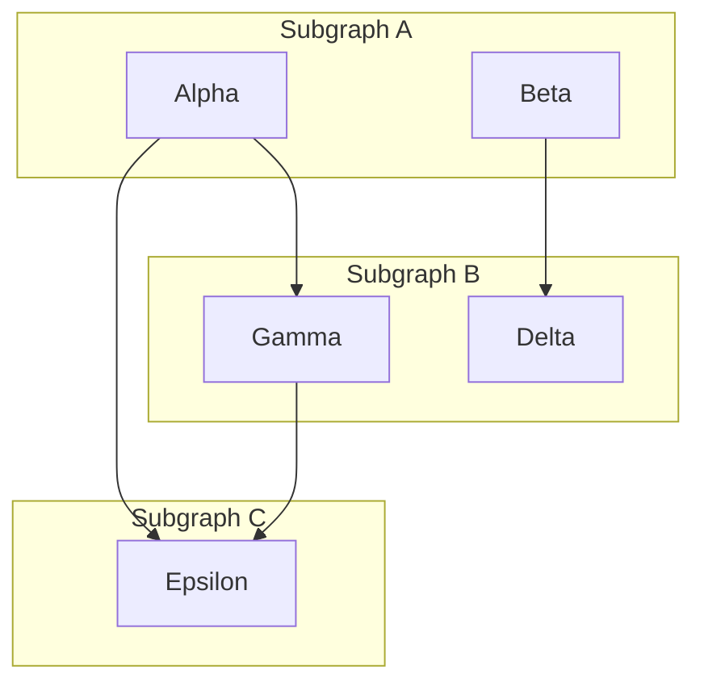

---
navigation:
  title: Mermaid Nested Subgraphs
  parent: visualtest/index.md
  position: 8170
---

<!--
测试目标：嵌套 subgraph（2层、3层）+ 跨 subgraph 边
不变式：嵌套框包含关系正确、配色分层、跨边不穿框
-->

## Two-Level Nesting

Expected: Outer subgraph contains two inner subgraphs; edges connect nodes across subgraph boundaries; subgraph borders use two different color layers (index 0, 1).

## Three-Level Nesting

Expected: Three layers of subgraph nesting with distinct background colors per depth level (index 0, 1, 2); edges cross subgraph boundaries correctly.

## Cross-Subgraph Edges

Expected: Edges connecting nodes in different subgraphs pass through subgraph box boundaries without being clipped or misrouted.

