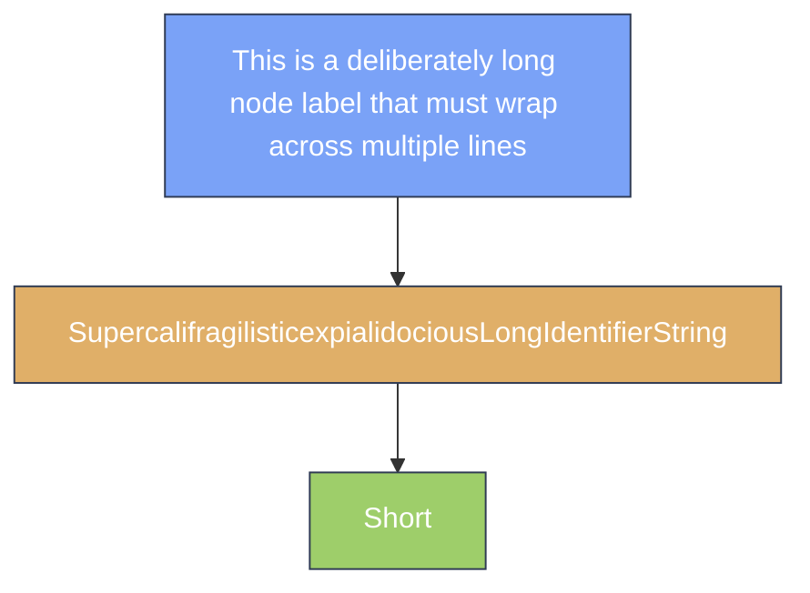

---
navigation:
  title: Mermaid Wrap (forced long-label fold)
  position: 8140
---

TEST GOAL / 测试目标：本页强制 mermaid 节点标签折行——长标签触发词级折行、长无空格词触发码点级折行，验证 GuideText.wrap 的折行结果决定节点框高

INVARIANTS / 不变式：长标签节点正确多行折行、节点框高随折行增加、无编译错误、无节点溢出

## Forced Wrap: Long Label vs Unbroken Long Word vs Short Control

Expected: The long-space-separated label (74 chars, > node single-line budget of 180px) folds across multiple lines via word-level wrapping; the long unbroken word (54 chars, no whitespace) folds via codepoint-level wrapping; the short control label stays on a single line. Node box heights grow with the number of wrapped lines; nothing overflows the diagram bounds.

