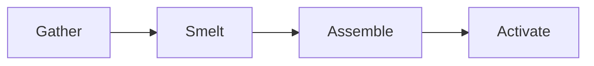

---
navigation:
  title: Mixed Syntax Stress Page
  position: 7600
---

TEST GOAL / 测试目标：全语法混合压力页——标题+表格+代码+公式+图+浮动+tabs+图表+mermaid+场景同页，特性间相互作用验证

INVARIANTS / 不变式：整体无可感知异常，以人工/多模态审阅为主

## Crafting Overview

<FloatingImage src="../assets/red-64.png" align="left" wrap="square" x="0" y="0" width="64" height="64" title="Crafting icon" />

This section demonstrates a floating image alongside a pipe table with column width metadata. The `FloatingImage` uses `wrap="square"` and `align="left"` so text wraps to its right side. The table below lists basic crafting materials required for the machine assembly. After the table, `<br clear="all">` resets the float context.

| Material | Amount | Source |
| --- | --- | --- |
| Iron Ingot | 5 | Smelting |
| Redstone | 12 | Mining |
| Diamond | 2 | Loot |
{: widths="100,60,80" }

<br clear="all">

Expected: Floating image sits to the left of the table; text wraps around the image; the table occupies the full width below the float after `clear`.

## Machine Logic

The `ContentTabs` block holds two tabs: one with a Java code snippet and one with a `BarChart`. This tests tab switching between disparate content types on the same page as a floating element and a table in the previous section.

<ContentTabs title="Machine Logic" iconItem="minecraft:furnace">
<Tab title="Control Code">

```java
public class MachineController {
    private int energy;
    public MachineController() {
        this.energy = 0;
    }
    public void tick() {
        if (this.energy < 1000) {
            this.energy += 10;
        }
    }
}
```

</Tab>
<Tab title="Production Chart">

<BarChart title="Energy Output" categories="T1,T2,T3,T4" labelPosition="outside">
  <Series name="Solar" data="120,150,180,160" color="#4E79A7" icon="minecraft:daylight_detector"/>
  <Series name="Wind" data="80,70,110,130" color="#F28E2B" icon="minecraft:wool"/>
</BarChart>

</Tab>
</ContentTabs>

Expected: Tabs render with a furnace icon; switching tabs toggles between the Java code block and the bar chart; no layout shift or content overlap during tab switch.

## Formulas and Recipes

This section mixes inline LaTeX with CJK text and display-style formulas using both `$$...$$` shorthand and the `<Latex>` tag. The `color` attribute on `<Latex>` changes formula colour.

The main reaction formula is $\Delta G = \Delta H - T\Delta S$ embedded in a CJK sentence describing 熵变与焓变的关系. A larger display formula shows the integral form:

$$\int_0^\infty e^{-x^2}\,dx = \frac{\sqrt{\pi}}{2}$$

The next formula uses the `<Latex>` tag with a gold color override:

<Latex formula="E=mc^2" color="#FFD700" />

Expected: Inline LaTeX aligns with CJK baseline; display formulas are centered; the gold-colored formula renders with distinct colour.

## Build Preview

A `GameScene` with diamond blocks and a beacon is annotated with `DiamondAnnotation` markers. Below the scene, a `mermaid` flowchart diagram is shown (renders fully — placeholder issue resolved in R4-R7 fix waves).

<GameScene width="320" height="160" zoom={4} interactive={true}>
  <Block id="minecraft:diamond_block" x="-1" z="-1" />
  <Block id="minecraft:diamond_block" x="-1" z="1" />
  <Block id="minecraft:diamond_block" x="1" z="-1" />
  <Block id="minecraft:diamond_block" x="1" z="1" />
  <Block id="minecraft:beacon" y="1" />
  <DiamondAnnotation pos="0.5 2.2 0.5" color="#FFD24C">
    Beacon Core
  </DiamondAnnotation>
  <DiamondAnnotation pos="1.5 1.5 1.5" color="#FF0000">
    Corner Marker
  </DiamondAnnotation>
</GameScene>

Below is a flowchart of the build process. Renders fully (placeholder issue resolved).



Expected: Scene renders diamond blocks at corners, beacon in center, two diamond annotations with distinct colors; mermaid renders the full flowchart (placeholder issue resolved).

## Summary

The following task list tracks verification items for this mixed syntax stress page.

- [x] Floating image with table wrapping
- [x] ContentTabs containing code and chart
- [ ] Inline LaTeX with CJK alignment verified
- [x] Mermaid flowchart rendered fully (placeholder issue resolved)
- [ ] GameScene annotations match expected positions

For more details on rendering, consult the [main guide](https://example.com/guidenh). A reference footnote[^stress] collects observations.

[^stress]: This stress page systematically exercises feature interactions — float with table, tabs with chart, LaTeX with CJK, scene with mermaid — to surface cross-feature layout defects.

Expected: Task checkboxes render in mixed states; link is clickable; footnote appears in the list at page bottom.
