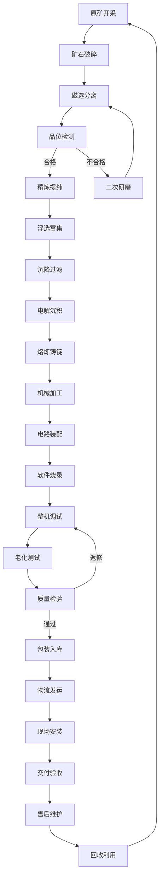
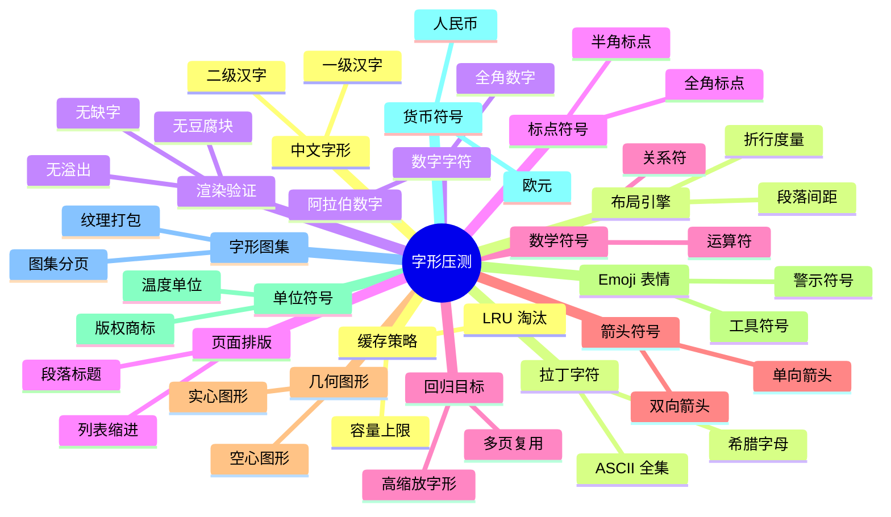

---
navigation:
  title: Glyph Atlas Capacity Stress
  position: 7610
---

TEST GOAL / 测试目标：大量唯一字形压力测试页——GB2312 一二级汉字全集（6763 唯一汉字）+ 完整可打印 ASCII + 特殊符号 + 长中文文本 + 大型 mermaid 图。用于回归验证 glyph atlas 容量管理（分页/LRU 改造）在高 zoom 大字形爆容场景下的行为。

INVARIANTS / 不变式：页面编译与渲染无阶段错误；全部唯一字形进入布局度量；glyph atlas 触及容量上限时按现行策略（丢弃新字形而非清空缓存）降级，不崩溃、无整段文字消失。

## 一、中文字形全集段（GB2312 一二级汉字 6763 字）

Expected: 以下 10 段密集排列 GB2312 一二级汉字全集共 6763 个唯一字形，每段内无重复；用于撑爆 glyph atlas 容量并回归验证分页/LRU 改造后的容量管理。

第 1 段（第 1–677 字）：

啊阿埃挨哎唉哀皑癌蔼矮艾碍爱隘鞍氨安俺按暗岸胺案肮昂盎凹敖熬翱袄傲奥懊澳芭捌扒叭吧笆八疤巴拔跋靶把耙坝霸罢爸白柏百摆佰败拜稗斑班搬扳般颁板版扮拌伴瓣半办绊邦帮梆榜膀绑棒磅蚌镑傍谤苞胞包褒剥薄雹保堡饱宝抱报暴豹鲍爆杯碑悲卑北辈背贝钡倍狈备惫焙被奔苯本笨崩绷甭泵蹦迸逼鼻比鄙笔彼碧蓖蔽毕毙毖币庇痹闭敝弊必辟壁臂避陛鞭边编贬扁便变卞辨辩辫遍标彪膘表鳖憋别瘪彬斌濒滨宾摈兵冰柄丙秉饼炳病并玻菠播拨钵波博勃搏铂箔伯帛舶脖膊渤泊驳捕卜哺补埠不布步簿部怖擦猜裁材才财睬踩采彩菜蔡餐参蚕残惭惨灿苍舱仓沧藏操糙槽曹草厕策侧册测层蹭插叉茬茶查碴搽察岔差诧拆柴豺搀掺蝉馋谗缠铲产阐颤昌猖场尝常长偿肠厂敞畅唱倡超抄钞朝嘲潮巢吵炒车扯撤掣彻澈郴臣辰尘晨忱沉陈趁衬撑称城橙成呈乘程惩澄诚承逞骋秤吃痴持匙池迟弛驰耻齿侈尺赤翅斥炽充冲虫崇宠抽酬畴踌稠愁筹仇绸瞅丑臭初出橱厨躇锄雏滁除楚础储矗搐触处揣川穿椽传船喘串疮窗幢床闯创吹炊捶锤垂春椿醇唇淳纯蠢戳绰疵茨磁雌辞慈瓷词此刺赐次聪葱囱匆从丛凑粗醋簇促蹿篡窜摧崔催脆瘁粹淬翠村存寸磋撮搓措挫错搭达答瘩打大呆歹傣戴带殆代贷袋待逮怠耽担丹单郸掸胆旦氮但惮淡诞弹蛋当挡党荡档刀捣蹈倒岛祷导到稻悼道盗德得的蹬灯登等瞪凳邓堤低滴迪敌笛狄涤翟嫡抵底地蒂第帝弟递缔颠掂滇碘点典靛垫电佃甸店惦奠淀殿碉叼雕凋刁掉吊钓调跌爹碟蝶迭谍叠丁盯叮钉顶鼎锭定订丢东冬董懂动栋侗恫冻洞兜抖斗陡豆逗痘都督毒犊独读堵睹赌杜镀肚度渡妒端短锻段断缎堆兑队对墩吨蹲敦顿囤钝盾遁掇哆多夺垛躲朵跺舵剁惰堕蛾峨鹅俄额讹娥恶厄扼遏鄂饿恩而儿耳尔饵洱二贰发罚筏伐乏阀法珐藩帆番翻樊矾钒繁凡烦

第 2 段（第 678–1354 字）：

反返范贩犯饭泛坊芳方肪房防妨仿访纺放菲非啡飞肥匪诽吠肺废沸费芬酚吩氛分纷坟焚汾粉奋份忿愤粪丰封枫蜂峰锋风疯烽逢冯缝讽奉凤佛否夫敷肤孵扶拂辐幅氟符伏俘服浮涪福袱弗甫抚辅俯釜斧脯腑府腐赴副覆赋复傅付阜父腹负富讣附妇缚咐噶嘎该改概钙盖溉干甘杆柑竿肝赶感秆敢赣冈刚钢缸肛纲岗港杠篙皋高膏羔糕搞镐稿告哥歌搁戈鸽胳疙割革葛格蛤阁隔铬个各给根跟耕更庚羹埂耿梗工攻功恭龚供躬公宫弓巩汞拱贡共钩勾沟苟狗垢构购够辜菇咕箍估沽孤姑鼓古蛊骨谷股故顾固雇刮瓜剐寡挂褂乖拐怪棺关官冠观管馆罐惯灌贯光广逛瑰规圭硅归龟闺轨鬼诡癸桂柜跪贵刽辊滚棍锅郭国果裹过哈骸孩海氦亥害骇酣憨邯韩含涵寒函喊罕翰撼捍旱憾悍焊汗汉夯杭航壕嚎豪毫郝好耗号浩呵喝荷菏核禾和何合盒貉阂河涸赫褐鹤贺嘿黑痕很狠恨哼亨横衡恒轰哄烘虹鸿洪宏弘红喉侯猴吼厚候后呼乎忽瑚壶葫胡蝴狐糊湖弧虎唬护互沪户花哗华猾滑画划化话槐徊怀淮坏欢环桓还缓换患唤痪豢焕涣宦幻荒慌黄磺蝗簧皇凰惶煌晃幌恍谎灰挥辉徽恢蛔回毁悔慧卉惠晦贿秽会烩汇讳诲绘荤昏婚魂浑混豁活伙火获或惑霍货祸击圾基机畸稽积箕肌饥迹激讥鸡姬绩缉吉极棘辑籍集及急疾汲即嫉级挤几脊己蓟技冀季伎祭剂悸济寄寂计记既忌际妓继纪嘉枷夹佳家加荚颊贾甲钾假稼价架驾嫁歼监坚尖笺间煎兼肩艰奸缄茧检柬碱硷拣捡简俭剪减荐槛鉴践贱见键箭件健舰剑饯渐溅涧建僵姜将浆江疆蒋桨奖讲匠酱降蕉椒礁焦胶交郊浇骄娇嚼搅铰矫侥脚狡角饺缴绞剿教酵轿较叫窖揭接皆秸街阶截劫节桔杰捷睫竭洁结解姐戒藉芥界借介疥诫届巾筋斤金今津襟紧锦仅谨进靳晋禁近烬浸尽劲荆兢茎睛晶鲸京惊精粳经井警景颈静境敬镜径痉靖竟竞净炯窘揪究纠玖韭久灸九酒

第 3 段（第 1355–2031 字）：

厩救旧臼舅咎就疚鞠拘狙疽居驹菊局咀矩举沮聚拒据巨具距踞锯俱句惧炬剧捐鹃娟倦眷卷绢撅攫抉掘倔爵觉决诀绝均菌钧军君峻俊竣浚郡骏喀咖卡咯开揩楷凯慨刊堪勘坎砍看康慷糠扛抗亢炕考拷烤靠坷苛柯棵磕颗科壳咳可渴克刻客课肯啃垦恳坑吭空恐孔控抠口扣寇枯哭窟苦酷库裤夸垮挎跨胯块筷侩快宽款匡筐狂框矿眶旷况亏盔岿窥葵奎魁傀馈愧溃坤昆捆困括扩廓阔垃拉喇蜡腊辣啦莱来赖蓝婪栏拦篮阑兰澜谰揽览懒缆烂滥琅榔狼廊郎朗浪捞劳牢老佬姥酪烙涝勒乐雷镭蕾磊累儡垒擂肋类泪棱楞冷厘梨犁黎篱狸离漓理李里鲤礼莉荔吏栗丽厉励砾历利傈例俐痢立粒沥隶力璃哩俩联莲连镰廉怜涟帘敛脸链恋炼练粮凉梁粱良两辆量晾亮谅撩聊僚疗燎寥辽潦了撂镣廖料列裂烈劣猎琳林磷霖临邻鳞淋凛赁吝拎玲菱零龄铃伶羚凌灵陵岭领另令溜琉榴硫馏留刘瘤流柳六龙聋咙笼窿隆垄拢陇楼娄搂篓漏陋芦卢颅庐炉掳卤虏鲁麓碌露路赂鹿潞禄录陆戮驴吕铝侣旅履屡缕虑氯律率滤绿峦挛孪滦卵乱掠略抡轮伦仑沦纶论萝螺罗逻锣箩骡裸落洛骆络妈麻玛码蚂马骂嘛吗埋买麦卖迈脉瞒馒蛮满蔓曼慢漫谩芒茫盲氓忙莽猫茅锚毛矛铆卯茂冒帽貌贸么玫枚梅酶霉煤没眉媒镁每美昧寐妹媚门闷们萌蒙檬盟锰猛梦孟眯醚靡糜迷谜弥米秘觅泌蜜密幂棉眠绵冕免勉娩缅面苗描瞄藐秒渺庙妙蔑灭民抿皿敏悯闽明螟鸣铭名命谬摸摹蘑模膜磨摩魔抹末莫墨默沫漠寞陌谋牟某拇牡亩姆母墓暮幕募慕木目睦牧穆拿哪呐钠那娜纳氖乃奶耐奈南男难囊挠脑恼闹淖呢馁内嫩能妮霓倪泥尼拟你匿腻逆溺蔫拈年碾撵捻念娘酿鸟尿捏聂孽啮镊镍涅您柠狞凝宁拧泞牛扭钮纽脓浓农弄奴努怒女暖虐疟挪懦糯诺哦欧鸥殴藕呕偶沤啪趴爬帕怕琶拍排牌徘湃派攀潘盘磐盼畔判叛乓庞旁耪胖抛咆刨

第 4 段（第 2032–2708 字）：

炮袍跑泡呸胚培裴赔陪配佩沛喷盆砰抨烹澎彭蓬棚硼篷膨朋鹏捧碰坯砒霹批披劈琵毗啤脾疲皮匹痞僻屁譬篇偏片骗飘漂瓢票撇瞥拼频贫品聘乒坪苹萍平凭瓶评屏坡泼颇婆破魄迫粕剖扑铺仆莆葡菩蒲埔朴圃普浦谱曝瀑期欺栖戚妻七凄漆柒沏其棋奇歧畦崎脐齐旗祈祁骑起岂乞企启契砌器气迄弃汽泣讫掐恰洽牵扦钎铅千迁签仟谦乾黔钱钳前潜遣浅谴堑嵌欠歉枪呛腔羌墙蔷强抢橇锹敲悄桥瞧乔侨巧鞘撬翘峭俏窍切茄且怯窃钦侵亲秦琴勤芹擒禽寝沁青轻氢倾卿清擎晴氰情顷请庆琼穷秋丘邱球求囚酋泅趋区蛆曲躯屈驱渠取娶龋趣去圈颧权醛泉全痊拳犬券劝缺炔瘸却鹊榷确雀裙群然燃冉染瓤壤攘嚷让饶扰绕惹热壬仁人忍韧任认刃妊纫扔仍日戎茸蓉荣融熔溶容绒冗揉柔肉茹蠕儒孺如辱乳汝入褥软阮蕊瑞锐闰润若弱撒洒萨腮鳃塞赛三叁伞散桑嗓丧搔骚扫嫂瑟色涩森僧莎砂杀刹沙纱傻啥煞筛晒珊苫杉山删煽衫闪陕擅赡膳善汕扇缮墒伤商赏晌上尚裳梢捎稍烧芍勺韶少哨邵绍奢赊蛇舌舍赦摄射慑涉社设砷申呻伸身深娠绅神沈审婶甚肾慎渗声生甥牲升绳省盛剩胜圣师失狮施湿诗尸虱十石拾时什食蚀实识史矢使屎驶始式示士世柿事拭誓逝势是嗜噬适仕侍释饰氏市恃室视试收手首守寿授售受瘦兽蔬枢梳殊抒输叔舒淑疏书赎孰熟薯暑曙署蜀黍鼠属术述树束戍竖墅庶数漱恕刷耍摔衰甩帅栓拴霜双爽谁水睡税吮瞬顺舜说硕朔烁斯撕嘶思私司丝死肆寺嗣四伺似饲巳松耸怂颂送宋讼诵搜艘擞嗽苏酥俗素速粟僳塑溯宿诉肃酸蒜算虽隋随绥髓碎岁穗遂隧祟孙损笋蓑梭唆缩琐索锁所塌他它她塔獭挞蹋踏胎苔抬台泰酞太态汰坍摊贪瘫滩坛檀痰潭谭谈坦毯袒碳探叹炭汤塘搪堂棠膛唐糖倘躺淌趟烫掏涛滔绦萄桃逃淘陶讨套特藤腾疼誊梯剔踢锑提题蹄啼体替嚏惕涕剃屉天

第 5 段（第 2709–3385 字）：

添填田甜恬舔腆挑条迢眺跳贴铁帖厅听烃汀廷停亭庭挺艇通桐酮瞳同铜彤童桶捅筒统痛偷投头透凸秃突图徒途涂屠土吐兔湍团推颓腿蜕褪退吞屯臀拖托脱鸵陀驮驼椭妥拓唾挖哇蛙洼娃瓦袜歪外豌弯湾玩顽丸烷完碗挽晚皖惋宛婉万腕汪王亡枉网往旺望忘妄威巍微危韦违桅围唯惟为潍维苇萎委伟伪尾纬未蔚味畏胃喂魏位渭谓尉慰卫瘟温蚊文闻纹吻稳紊问嗡翁瓮挝蜗涡窝我斡卧握沃巫呜钨乌污诬屋无芜梧吾吴毋武五捂午舞伍侮坞戊雾晤物勿务悟误昔熙析西硒矽晰嘻吸锡牺稀息希悉膝夕惜熄烯溪汐犀檄袭席习媳喜铣洗系隙戏细瞎虾匣霞辖暇峡侠狭下厦夏吓掀锨先仙鲜纤咸贤衔舷闲涎弦嫌显险现献县腺馅羡宪陷限线相厢镶香箱襄湘乡翔祥详想响享项巷橡像向象萧硝霄削哮嚣销消宵淆晓小孝校肖啸笑效楔些歇蝎鞋协挟携邪斜胁谐写械卸蟹懈泄泻谢屑薪芯锌欣辛新忻心信衅星腥猩惺兴刑型形邢行醒幸杏性姓兄凶胸匈汹雄熊休修羞朽嗅锈秀袖绣墟戌需虚嘘须徐许蓄酗叙旭序畜恤絮婿绪续轩喧宣悬旋玄选癣眩绚靴薛学穴雪血勋熏循旬询寻驯巡殉汛训讯逊迅压押鸦鸭呀丫芽牙蚜崖衙涯雅哑亚讶焉咽阉烟淹盐严研蜒岩延言颜阎炎沿奄掩眼衍演艳堰燕厌砚雁唁彦焰宴谚验殃央鸯秧杨扬佯疡羊洋阳氧仰痒养样漾邀腰妖瑶摇尧遥窑谣姚咬舀药要耀椰噎耶爷野冶也页掖业叶曳腋夜液一壹医揖铱依伊衣颐夷遗移仪胰疑沂宜姨彝椅蚁倚已乙矣以艺抑易邑屹亿役臆逸肄疫亦裔意毅忆义益溢诣议谊译异翼翌绎茵荫因殷音阴姻吟银淫寅饮尹引隐印英樱婴鹰应缨莹萤营荧蝇迎赢盈影颖硬映哟拥佣臃痈庸雍踊蛹咏泳涌永恿勇用幽优悠忧尤由邮铀犹油游酉有友右佑釉诱又幼迂淤于盂榆虞愚舆余俞逾鱼愉渝渔隅予娱雨与屿禹宇语羽玉域芋郁吁遇喻峪御愈欲狱育誉浴

第 6 段（第 3386–4062 字）：

寓裕预豫驭鸳渊冤元垣袁原援辕园员圆猿源缘远苑愿怨院曰约越跃钥岳粤月悦阅耘云郧匀陨允运蕴酝晕韵孕匝砸杂栽哉灾宰载再在咱攒暂赞赃脏葬遭糟凿藻枣早澡蚤躁噪造皂灶燥责择则泽贼怎增憎曾赠扎喳渣札轧铡闸眨栅榨咋乍炸诈摘斋宅窄债寨瞻毡詹粘沾盏斩辗崭展蘸栈占战站湛绽樟章彰漳张掌涨杖丈帐账仗胀瘴障招昭找沼赵照罩兆肇召遮折哲蛰辙者锗蔗这浙珍斟真甄砧臻贞针侦枕疹诊震振镇阵蒸挣睁征狰争怔整拯正政帧症郑证芝枝支吱蜘知肢脂汁之织职直植殖执值侄址指止趾只旨纸志挚掷至致置帜峙制智秩稚质炙痔滞治窒中盅忠钟衷终种肿重仲众舟周州洲诌粥轴肘帚咒皱宙昼骤珠株蛛朱猪诸诛逐竹烛煮拄瞩嘱主著柱助蛀贮铸筑住注祝驻抓爪拽专砖转撰赚篆桩庄装妆撞壮状椎锥追赘坠缀谆准捉拙卓桌琢茁酌啄着灼浊兹咨资姿滋淄孜紫仔籽滓子自渍字鬃棕踪宗综总纵邹走奏揍租足卒族祖诅阻组钻纂嘴醉最罪尊遵昨左佐柞做作坐座亍丌兀丐廿卅丕亘丞鬲孬噩丨禺丿匕乇夭爻卮氐囟胤馗毓睾鼗丶亟鼐乜乩亓芈孛啬嘏仄厍厝厣厥厮靥赝匚叵匦匮匾赜卦卣刂刈刎刭刳刿剀剌剞剡剜蒯剽劂劁劐劓冂罔亻仃仉仂仨仡仫仞伛仳伢佤仵伥伧伉伫佞佧攸佚佝佟佗伲伽佶佴侑侉侃侏佾佻侪佼侬侔俦俨俪俅俚俣俜俑俟俸倩偌俳倬倏倮倭俾倜倌倥倨偾偃偕偈偎偬偻傥傧傩傺僖儆僭僬僦僮儇儋仝氽佘佥俎龠汆籴兮巽黉馘冁夔勹匍訇匐凫夙兕亠兖亳衮袤亵脔裒禀嬴蠃羸冫冱冽冼凇冖冢冥讠讦讧讪讴讵讷诂诃诋诏诎诒诓诔诖诘诙诜诟诠诤诨诩诮诰诳诶诹诼诿谀谂谄谇谌谏谑谒谔谕谖谙谛谘谝谟谠谡谥谧谪谫谮谯谲谳谵谶卩卺阝阢阡阱阪阽阼陂陉陔陟陧陬陲陴隈隍隗隰邗邛邝邙邬邡邴邳邶邺邸邰郏郅邾郐郄郇郓郦郢郜郗郛郫郯郾鄄鄢鄞鄣鄱鄯鄹酃

第 7 段（第 4063–4739 字）：

酆刍奂劢劬劭劾哿勐勖勰叟燮矍廴凵凼鬯厶弁畚巯坌垩垡塾墼壅壑圩圬圪圳圹圮圯坜圻坂坩垅坫垆坼坻坨坭坶坳垭垤垌垲埏垧垴垓垠埕埘埚埙埒垸埴埯埸埤埝堋堍埽埭堀堞堙塄堠塥塬墁墉墚墀馨鼙懿艹艽艿芏芊芨芄芎芑芗芙芫芸芾芰苈苊苣芘芷芮苋苌苁芩芴芡芪芟苄苎芤苡茉苷苤茏茇苜苴苒苘茌苻苓茑茚茆茔茕苠苕茜荑荛荜茈莒茼茴茱莛荞茯荏荇荃荟荀茗荠茭茺茳荦荥荨茛荩荬荪荭荮莰荸莳莴莠莪莓莜莅荼莶莩荽莸荻莘莞莨莺莼菁萁菥菘堇萘萋菝菽菖萜萸萑萆菔菟萏萃菸菹菪菅菀萦菰菡葜葑葚葙葳蒇蒈葺蒉葸萼葆葩葶蒌蒎萱葭蓁蓍蓐蓦蒽蓓蓊蒿蒺蓠蒡蒹蒴蒗蓥蓣蔌甍蔸蓰蔹蔟蔺蕖蔻蓿蓼蕙蕈蕨蕤蕞蕺瞢蕃蕲蕻薤薨薇薏蕹薮薜薅薹薷薰藓藁藜藿蘧蘅蘩蘖蘼廾弈夼奁耷奕奚奘匏尢尥尬尴扌扪抟抻拊拚拗拮挢拶挹捋捃掭揶捱捺掎掴捭掬掊捩掮掼揲揸揠揿揄揞揎摒揆掾摅摁搋搛搠搌搦搡摞撄摭撖摺撷撸撙撺擀擐擗擤擢攉攥攮弋忒甙弑卟叱叽叩叨叻吒吖吆呋呒呓呔呖呃吡呗呙吣吲咂咔呷呱呤咚咛咄呶呦咝哐咭哂咴哒咧咦哓哔呲咣哕咻咿哌哙哚哜咩咪咤哝哏哞唛哧唠哽唔哳唢唣唏唑唧唪啧喏喵啉啭啁啕唿啐唼唷啖啵啶啷唳唰啜喋嗒喃喱喹喈喁喟啾嗖喑啻嗟喽喾喔喙嗪嗷嗉嘟嗑嗫嗬嗔嗦嗝嗄嗯嗥嗲嗳嗌嗍嗨嗵嗤辔嘞嘈嘌嘁嘤嘣嗾嘀嘧嘭噘嘹噗嘬噍噢噙噜噌噔嚆噤噱噫噻噼嚅嚓嚯囔囗囝囡囵囫囹囿圄圊圉圜帏帙帔帑帱帻帼帷幄幔幛幞幡岌屺岍岐岖岈岘岙岑岚岜岵岢岽岬岫岱岣峁岷峄峒峤峋峥崂崃崧崦崮崤崞崆崛嵘崾崴崽嵬嵛嵯嵝嵫嵋嵊嵩嵴嶂嶙嶝豳嶷巅彳彷徂徇徉後徕徙徜徨徭徵徼衢彡犭犰犴犷犸狃狁狎狍狒狨狯狩狲狴狷猁狳猃狺狻猗猓猡猊猞猝猕猢猹猥猬猸猱獐獍獗獠獬獯獾舛夥飧夤夂饣饧饨饩饪饫饬饴饷饽馀馄馇馊馍馐馑馓

第 8 段（第 4740–5416 字）：

馔馕庀庑庋庖庥庠庹庵庾庳赓廒廑廛廨廪膺忄忉忖忏怃忮怄忡忤忾怅怆忪忭忸怙怵怦怛怏怍怩怫怊怿怡恸恹恻恺恂恪恽悖悚悭悝悃悒悌悛惬悻悱惝惘惆惚悴愠愦愕愣惴愀愎愫慊慵憬憔憧憷懔懵忝隳闩闫闱闳闵闶闼闾阃阄阆阈阊阋阌阍阏阒阕阖阗阙阚丬爿戕氵汔汜汊沣沅沐沔沌汨汩汴汶沆沩泐泔沭泷泸泱泗沲泠泖泺泫泮沱泓泯泾洹洧洌浃浈洇洄洙洎洫浍洮洵洚浏浒浔洳涑浯涞涠浞涓涔浜浠浼浣渚淇淅淞渎涿淠渑淦淝淙渖涫渌涮渫湮湎湫溲湟溆湓湔渲渥湄滟溱溘滠漭滢溥溧溽溻溷滗溴滏溏滂溟潢潆潇漤漕滹漯漶潋潴漪漉漩澉澍澌潸潲潼潺濑濉澧澹澶濂濡濮濞濠濯瀚瀣瀛瀹瀵灏灞宀宄宕宓宥宸甯骞搴寤寮褰寰蹇謇辶迓迕迥迮迤迩迦迳迨逅逄逋逦逑逍逖逡逵逶逭逯遄遑遒遐遨遘遢遛暹遴遽邂邈邃邋彐彗彖彘尻咫屐屙孱屣屦羼弪弩弭艴弼鬻屮妁妃妍妩妪妣妗姊妫妞妤姒妲妯姗妾娅娆姝娈姣姘姹娌娉娲娴娑娣娓婀婧婊婕娼婢婵胬媪媛婷婺媾嫫媲嫒嫔媸嫠嫣嫱嫖嫦嫘嫜嬉嬗嬖嬲嬷孀尕尜孚孥孳孑孓孢驵驷驸驺驿驽骀骁骅骈骊骐骒骓骖骘骛骜骝骟骠骢骣骥骧纟纡纣纥纨纩纭纰纾绀绁绂绉绋绌绐绔绗绛绠绡绨绫绮绯绱绲缍绶绺绻绾缁缂缃缇缈缋缌缏缑缒缗缙缜缛缟缡缢缣缤缥缦缧缪缫缬缭缯缰缱缲缳缵幺畿巛甾邕玎玑玮玢玟珏珂珑玷玳珀珉珈珥珙顼琊珩珧珞玺珲琏琪瑛琦琥琨琰琮琬琛琚瑁瑜瑗瑕瑙瑷瑭瑾璜璎璀璁璇璋璞璨璩璐璧瓒璺韪韫韬杌杓杞杈杩枥枇杪杳枘枧杵枨枞枭枋杷杼柰栉柘栊柩枰栌柙枵柚枳柝栀柃枸柢栎柁柽栲栳桠桡桎桢桄桤梃栝桕桦桁桧桀栾桊桉栩梵梏桴桷梓桫棂楮棼椟椠棹椤棰椋椁楗棣椐楱椹楠楂楝榄楫榀榘楸椴槌榇榈槎榉楦楣楹榛榧榻榫榭槔榱槁槊槟榕槠榍槿樯槭樗樘橥槲橄樾檠橐橛樵檎橹樽樨橘橼檑檐檩檗檫

第 9 段（第 5417–6093 字）：

猷獒殁殂殇殄殒殓殍殚殛殡殪轫轭轱轲轳轵轶轸轷轹轺轼轾辁辂辄辇辋辍辎辏辘辚軎戋戗戛戟戢戡戥戤戬臧瓯瓴瓿甏甑甓攴旮旯旰昊昙杲昃昕昀炅曷昝昴昱昶昵耆晟晔晁晏晖晡晗晷暄暌暧暝暾曛曜曦曩贲贳贶贻贽赀赅赆赈赉赇赍赕赙觇觊觋觌觎觏觐觑牮犟牝牦牯牾牿犄犋犍犏犒挈挲掰搿擘耄毪毳毽毵毹氅氇氆氍氕氘氙氚氡氩氤氪氲攵敕敫牍牒牖爰虢刖肟肜肓肼朊肽肱肫肭肴肷胧胨胩胪胛胂胄胙胍胗朐胝胫胱胴胭脍脎胲胼朕脒豚脶脞脬脘脲腈腌腓腴腙腚腱腠腩腼腽腭腧塍媵膈膂膑滕膣膪臌朦臊膻臁膦欤欷欹歃歆歙飑飒飓飕飙飚殳彀毂觳斐齑斓於旆旄旃旌旎旒旖炀炜炖炝炻烀炷炫炱烨烊焐焓焖焯焱煳煜煨煅煲煊煸煺熘熳熵熨熠燠燔燧燹爝爨灬焘煦熹戾戽扃扈扉礻祀祆祉祛祜祓祚祢祗祠祯祧祺禅禊禚禧禳忑忐怼恝恚恧恁恙恣悫愆愍慝憩憝懋懑戆肀聿沓泶淼矶矸砀砉砗砘砑斫砭砜砝砹砺砻砟砼砥砬砣砩硎硭硖硗砦硐硇硌硪碛碓碚碇碜碡碣碲碹碥磔磙磉磬磲礅磴礓礤礞礴龛黹黻黼盱眄眍盹眇眈眚眢眙眭眦眵眸睐睑睇睃睚睨睢睥睿瞍睽瞀瞌瞑瞟瞠瞰瞵瞽町畀畎畋畈畛畲畹疃罘罡罟詈罨罴罱罹羁罾盍盥蠲钅钆钇钋钊钌钍钏钐钔钗钕钚钛钜钣钤钫钪钭钬钯钰钲钴钶钷钸钹钺钼钽钿铄铈铉铊铋铌铍铎铐铑铒铕铖铗铙铘铛铞铟铠铢铤铥铧铨铪铩铫铮铯铳铴铵铷铹铼铽铿锃锂锆锇锉锊锍锎锏锒锓锔锕锖锘锛锝锞锟锢锪锫锩锬锱锲锴锶锷锸锼锾锿镂锵镄镅镆镉镌镎镏镒镓镔镖镗镘镙镛镞镟镝镡镢镤镥镦镧镨镩镪镫镬镯镱镲镳锺矧矬雉秕秭秣秫稆嵇稃稂稞稔稹稷穑黏馥穰皈皎皓皙皤瓞瓠甬鸠鸢鸨鸩鸪鸫鸬鸲鸱鸶鸸鸷鸹鸺鸾鹁鹂鹄鹆鹇鹈鹉鹋鹌鹎鹑鹕鹗鹚鹛鹜鹞鹣鹦鹧鹨鹩鹪鹫鹬鹱鹭鹳疒疔疖疠疝疬疣疳疴疸痄疱疰痃痂痖痍痣痨痦痤痫痧瘃痱

第 10 段（第 6094–6763 字）：

痼痿瘐瘀瘅瘌瘗瘊瘥瘘瘕瘙瘛瘼瘢瘠癀瘭瘰瘿瘵癃瘾瘳癍癞癔癜癖癫癯翊竦穸穹窀窆窈窕窦窠窬窨窭窳衤衩衲衽衿袂袢裆袷袼裉裢裎裣裥裱褚裼裨裾裰褡褙褓褛褊褴褫褶襁襦襻疋胥皲皴矜耒耔耖耜耠耢耥耦耧耩耨耱耋耵聃聆聍聒聩聱覃顸颀颃颉颌颍颏颔颚颛颞颟颡颢颥颦虍虔虬虮虿虺虼虻蚨蚍蚋蚬蚝蚧蚣蚪蚓蚩蚶蛄蚵蛎蚰蚺蚱蚯蛉蛏蚴蛩蛱蛲蛭蛳蛐蜓蛞蛴蛟蛘蛑蜃蜇蛸蜈蜊蜍蜉蜣蜻蜞蜥蜮蜚蜾蝈蜴蜱蜩蜷蜿螂蜢蝽蝾蝻蝠蝰蝌蝮螋蝓蝣蝼蝤蝙蝥螓螯螨蟒蟆螈螅螭螗螃螫蟥螬螵螳蟋蟓螽蟑蟀蟊蟛蟪蟠蟮蠖蠓蟾蠊蠛蠡蠹蠼缶罂罄罅舐竺竽笈笃笄笕笊笫笏筇笸笪笙笮笱笠笥笤笳笾笞筘筚筅筵筌筝筠筮筻筢筲筱箐箦箧箸箬箝箨箅箪箜箢箫箴篑篁篌篝篚篥篦篪簌篾篼簏簖簋簟簪簦簸籁籀臾舁舂舄臬衄舡舢舣舭舯舨舫舸舻舳舴舾艄艉艋艏艚艟艨衾袅袈裘裟襞羝羟羧羯羰羲籼敉粑粝粜粞粢粲粼粽糁糇糌糍糈糅糗糨艮暨羿翎翕翥翡翦翩翮翳糸絷綦綮繇纛麸麴赳趄趔趑趱赧赭豇豉酊酐酎酏酤酢酡酰酩酯酽酾酲酴酹醌醅醐醍醑醢醣醪醭醮醯醵醴醺豕鹾趸跫踅蹙蹩趵趿趼趺跄跖跗跚跞跎跏跛跆跬跷跸跣跹跻跤踉跽踔踝踟踬踮踣踯踺蹀踹踵踽踱蹉蹁蹂蹑蹒蹊蹰蹶蹼蹯蹴躅躏躔躐躜躞豸貂貊貅貘貔斛觖觞觚觜觥觫觯訾謦靓雩雳雯霆霁霈霏霎霪霭霰霾龀龃龅龆龇龈龉龊龌黾鼋鼍隹隼隽雎雒瞿雠銎銮鋈錾鍪鏊鎏鐾鑫鱿鲂鲅鲆鲇鲈稣鲋鲎鲐鲑鲒鲔鲕鲚鲛鲞鲟鲠鲡鲢鲣鲥鲦鲧鲨鲩鲫鲭鲮鲰鲱鲲鲳鲴鲵鲶鲷鲺鲻鲼鲽鳄鳅鳆鳇鳊鳋鳌鳍鳎鳏鳐鳓鳔鳕鳗鳘鳙鳜鳝鳟鳢靼鞅鞑鞒鞔鞯鞫鞣鞲鞴骱骰骷鹘骶骺骼髁髀髅髂髋髌髑魅魃魇魉魈魍魑飨餍餮饕饔髟髡髦髯髫髻髭髹鬈鬏鬓鬟鬣麽麾縻麂麇麈麋麒鏖麝麟黛黜黝黠黟黢黩黧黥黪黯鼢鼬鼯鼹鼷鼽鼾齄

## 二、完整可打印 ASCII 与常见标点段

Expected: 下列行内文本与代码块覆盖完整可打印 ASCII（0x20–0x7E 共 95 字符）与常见中英标点，每字符至少出现一次。

完整 ASCII 可打印字符（行内文本，特殊字符按实体转义）：

  ! &quot; # $ % &amp; ' ( ) * + , - . / 0 1 2 3 4 5 6 7 8 9 : ; &lt; = &gt; ? @ A B C D E F G H I J K L M N O P Q R S T U V W X Y Z [ \ ] ^ _ ` a b c d e f g h i j k l m n o p q r s t u v w x y z { | } ~

完整 ASCII 可打印字符（代码块内字面原文）：

```text
 !"#$%&'()*+,-./0123456789:;<=>?@ABCDEFGHIJKLMNOPQRSTUVWXYZ[\]^_`abcdefghijklmnopqrstuvwxyz{|}~
```

常见全角标点与中文标点：

，。、；：？！（）【】「」《》…——～·‘’“”

## 三、特殊符号段（emoji / 数学 / 箭头 / 几何）

Expected: emoji、数学符号、箭头、几何图形、单位与版权符号每类至少出现一次；渲染不崩溃、无阶段错误。

Emoji 与警示符号：

⚠ ☢ ☣ ☠ ⛔ ⚡ ⛏ 🔥 🌍 ⭐ 💎 🧪 ⚙ 🔧 🛠 ⚒ ✨ 💥 🏭 📦 🚀

数学与逻辑符号：

∑ ∏ π √ ∞ ∫ ∂ ∆ ≈ ≠ ≤ ≥ ± × ÷ ½ ¼ ¾ ‰ ′ ″ µ

箭头符号：

→ ← ↑ ↓ ↔ ↕ ⇒ ⇐ ⇑ ⇓ ⇔ ⇄ ↦ ↝ ↺ ↻ ⟶ ⟵ ⇢ ⇠

几何图形：

■ □ ▪ ▫ ▲ △ ▼ ▽ ◆ ◇ ○ ● ◎ ◐ ◑ ★ ☆ ✦ ♠ ♥ ♦ ♣

单位、版权与杂项符号：

§ ℃ ℉ ° ™ © ® € ¥ £ ₽ ¢ № † ‡ ¤ ² ³ ¹

## 四、长中文文本段（真实语义，每段 300+ 字）

Expected: 三段具有真实语义的长中文文本，每段超过 300 字，用于验证长文本下的字形复用与折行。

### 段落一：GuideNH 渲染管线说明

GuideNH 的渲染管线从资源包中的 Markdown 源文件开始，经过编译阶段把标记文本转换为布局树，再由 Rust 排版引擎按照页面宽度完成折行与度量，最终将每一个字形栅格化后打包进一张共享的纹理图集。字形图集是一块固定大小的二维纹理，所有文字绘制都从这里读取小图块并换算成纹理坐标。当页面包含大量互不相同的汉字时，图集空间会被迅速填满；如果容量管理不完善，高缩放倍率下的大尺寸字形会更快耗尽剩余空间，进而出现个别字形缺失。这条管线还同时承担浮动图片、表格、代码块、图表与 mermaid 图的混合布局，因此对字形图集的复用策略提出了很高的要求，任何单页超量的字形集合都可能触发容量问题。编译阶段会把标题、段落、列表与代码块逐层转换为布局节点，每个节点的文本内容随后被送入排版引擎度量宽度，计算出行高与换行位置，最后统一交给渲染阶段绘制。整个过程中字形缓存与图集上传的节奏必须保持一致，否则就会出现同一页面内部前一段落有字而后一段落缺字的反常现象，这种缺陷在人工审阅时极难察觉，必须依靠专门的回归页面反复触发才能稳定暴露。

### 段落二：字形图集容量与分页/LRU 策略

字形图集容量管理是渲染稳定性的关键环节。现行实现采用单张固定尺寸的纹理并配合简单的行式打包，一旦剩余空间不足就会丢弃新字形，表现为个别文字缺笔画或者整块空缺，严重时影响阅读体验。即将实施的分页与最近最少使用淘汰策略将把图集拆分为多个页面，并在容量逼近上限时优先淘汰最久未被引用的字形，从而让同一页面内反复出现的文字始终保持可绘制状态。回归测试页需要人为制造大量唯一字形来验证新策略：既要保证初次全量布局时所有字形都能进入度量阶段，又要验证翻页之后旧字形可以被回收，而常用字形不会被误淘汰。这样设计才能同时覆盖容量上限触达、翻页复用与淘汰正确性三条回归路径。分页策略通常会为每个页面分配独立的纹理单元，并按字符出现频率决定页面间的分配比例；淘汰策略则记录每个字形的最近引用时间戳，在需要腾出空间时批量回收最旧的条目。这两套机制彼此配合，既限制了单张纹理的体积，又保证了高频文字的命中率，是图集容量问题从根上得到缓解的关键所在。

### 段落三：回归验证流程说明

本次回归验证以本压测页作为统一入口：页面上半部分密集排列 GB2312 一二级汉字全集，中段覆盖完整可打印 ASCII 与常见标点，随后是表情、数学、箭头、几何等特殊符号，最后以三段真实语义的长文与两个大型 mermaid 图收尾。验证时使用无头渲染方式生成整页截图，并依据布局边界数据检查是否存在块溢出、零尺寸或者文字重叠。渲染日志中一旦出现图集容量告警，就说明压测已经触及容量上限，此时应结合分页与淘汰策略的回归结果判定改造是否达到预期。整个流程应当在有限的时间预算内稳定复现，避免依赖随机性，以便在每次渲染轮次中给出可对比的基线。截图产出后还需要人工或者多模态模型对几个关键区域做定点确认：第一是汉字密集段是否存在成片缺字，第二是特殊符号段是否出现大量豆腐块，第三是 mermaid 大图是否被错误替换为占位符。只有这三项同时满足要求，本次容量管理改造才算真正通过回归验收，后续迭代中任何图集相关的改动都要先跑本页。

## 五、mermaid 大图段

Expected: flowchart 22 个中文标签节点完整渲染非 stub；mindmap 16 个中文分支完整渲染非 stub；无编译错误。

### Flowchart：矿石加工流水线（22 节点，中文标签）



### Mindmap：字形压测主题树（16 分支，中文标签）


